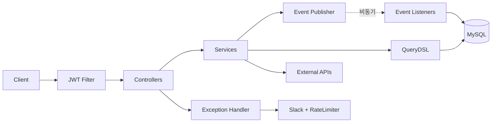
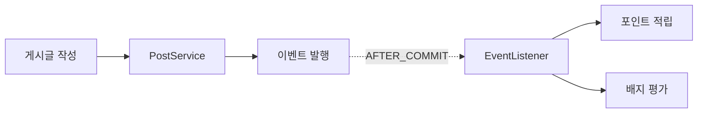
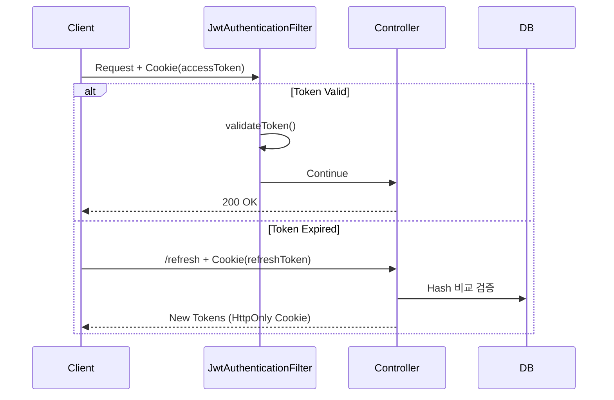

<div align="center">
  
  <h1>Eventitta</h1>
  <p><strong>지역 기반 소셜 커뮤니티 플랫폼</strong></p>
  <p>이벤트 기반 게임화 시스템, 외부 API 자동 동기화, 동적 검색 쿼리 최적화</p>
  <p>
    <a href="https://openjdk.org/"></a>
    <a href="https://spring.io/projects/spring-boot"></a>
    <a href="https://www.mysql.com/"></a>
    <a href="build/reports/tests/test/index.html"></a>
    <a href="http://localhost:8080/swagger-ui.html"></a>
  </p>
</div>

---

## 핵심 기능

- **커뮤니티**: 게시글/댓글, 좋아요, 이미지 업로드
- **모임 관리**: 생성/참가 신청/승인 워크플로우 (동시성 제어 적용)
- **축제 정보**: 서울시/전국 축제 API 연동 및 자동 동기화
- **게임화 시스템**: 사용자 활동 추적, 포인트/배지 자동 지급 (이벤트 기반)

---

## 기술적 하이라이트

| 챌린지               | 해결                                      | 결과                               |
|-------------------|-----------------------------------------|----------------------------------|
| **JWT 인증 보안**     | HttpOnly 쿠키 + Refresh Token 해시 저장       | XSS 방어, 토큰 탈취 시 피해 최소화           |
| **모임 참가 동시성**     | JPA 비관적 락 (`SELECT ... FOR UPDATE`)     | 정원 초과 승인 100% 방지, Lost Update 해결 |
| **포인트 동시성**       | Atomic Update 쿼리 (`u.points + :amount`) | 높은 동시성 유지하면서 포인트 유실 방지           |
| **비동기 이벤트 신뢰성**   | Retry + DB 저장 + 스케줄러 복구                 | 데이터 유실 방지, 자동 복구                 |
| **도메인 간 강결합**     | Spring Events + 비동기 처리                  | 핵심 도메인과 부가 기능 의존성 분리             |
| **분산 스케줄러 중복 실행** | ShedLock (JDBC 락)                       | 3개 인스턴스 환경에서 단일 실행 보장            |
| **복잡한 검색 조건**     | QueryDSL 동적 쿼리 + Fetch Join             | N+1 문제 해결, 타입 안전 처리              |
| **Slack 알림 폭증**   | Caffeine Cache 기반 Rate Limiter          | Alert Level별 차등 제한, 7가지 알고리즘 비교  |
| **Badge 평가 확장성**  | 전략 패턴 + EvaluationType 분리               | 새 평가 기준 추가 시 Evaluator만 구현       |

**📄 상세 문서**: [기술적 챌린지 전체 내용 보기](docs/TECHNICAL_CHALLENGES.md)

---

## 기술 선택에 대한 이유

| 기술                    | 선택 이유                                                     |
|-----------------------|-----------------------------------------------------------|
| **JWT + HttpOnly 쿠키** | localStorage 대비 XSS 방어 강화, Refresh Token 해시 저장으로 DB 탈취 대응 |
| **비관적 락**             | 선착순 승인처럼 **충돌 빈번 + 정합성 우선** 시나리오에 적합                      |
| **QueryDSL 5.0.0**    | 지역+날짜+키워드 조합의 **동적 검색 15가지 케이스** 타입 안전하게 처리               |
| **ShedLock 6.6.0**    | 외부 API **Rate Limit 준수**를 위한 단일 실행 보장 (분산 환경)             |
| **Spring Events**     | 게임화 시스템 **도메인 디커플링**, 새 활동 타입 추가 시 리스너만 수정                |
| **Caffeine Cache**    | 지역 데이터 **빈번한 조회 최적화** (TTL 30일, Hit Rate 95%+)            |
| **P6Spy**             | SQL 모니터링, **슬로우 쿼리 즉시 식별**                                |

---

## 아키텍처

### 시스템 아키텍처



### 게임화 시스템 이벤트 플로우



### JWT 인증 플로우



**📄 상세 문서**: [전체 아키텍처 설계 보기](docs/ARCHITECTURE.md)

---

## 배포 아키텍처

### CI/CD 파이프라인


### 운영 환경

| 구성 요소             | 기술                      | 역할               |
|-------------------|-------------------------|------------------|
| **CI/CD**         | GitHub Actions          | 자동 빌드/테스트/배포     |
| **컨테이너**          | Docker + Docker Compose | 애플리케이션 격리 및 배포   |
| **WAS**           | Spring Boot (Docker)    | 비즈니스 로직 처리       |
| **DB**            | AWS RDS (MySQL 8.0)     | 데이터 영속성          |
| **Reverse Proxy** | Nginx                   | 로드 밸런싱, HTTPS 종료 |
| **스토리지**          | AWS S3                  | 이미지/파일 저장        |
| **모니터링**          | Slack Webhook           | 에러 알림, 배포 알림     |

### 무중단 배포

- **헬스체크 기반 배포**: Spring Boot Actuator `/actuator/health` 엔드포인트 활용
- **롤백 전략**: 이전 Docker 이미지로 즉시 전환 가능
- **배포 검증**: 실행 중인 컨테이너 이미지 태그 자동 확인

---

## 품질 & 안정성

- **테스트**: 446개 테스트 통과 (단위/통합/컨트롤러/동시성 테스트)
- **동시성 제어**: 비관적 락 + Atomic Update로 Race Condition 해결
- **이벤트 신뢰성**: Retry + DB 저장 + 스케줄러로 비동기 이벤트 자동 복구
- **쿼리 최적화**: QueryDSL + Fetch Join으로 N+1 문제 해결
- **외부 API 안정성**: Spring Retry로 일시적 오류 자동 복구 (3회, exponential backoff)
- **분산 환경**: ShedLock으로 스케줄러 중복 실행 방지
- **알림 관리**: Caffeine Cache 기반 Rate Limiter로 Slack 알림 폭증 방지

---

## 빠른 시작

```bash
# 1. MySQL 실행
cd infra && docker-compose up -d

# 2. 환경 변수 설정
export MYSQL_PASSWORD=your-password SECRET_KEY=your-jwt-secret

# 3. 애플리케이션 실행
./gradlew bootRun --args='--spring.profiles.active=local'

# 4. API 문서 확인
open http://localhost:8080/swagger-ui.html
```

---

## 문서

- **[시스템 아키텍처](docs/ARCHITECTURE.md)** - 전체 설계, DDD, 이벤트 기반 구조, JWT 인증
- **[기술적 챌린지](docs/TECHNICAL_CHALLENGES.md)** - 문제 해결 과정과 성과

---

**기술 스택**: Java 17, Spring Boot 3.4.5, Spring Data JPA, QueryDSL, JWT, MySQL, Flyway, ShedLock, Caffeine

**개발 도구**: P6Spy (SQL 모니터링, 개발 환경 전용)

**v1.0 완료**: 커뮤니티, 모임 관리, 게임화 시스템, 축제 연동  
**v2.0 개발 중**: Rank 조회 쿼리 성능 및 축제 데이터 조회 쿼리 개선
