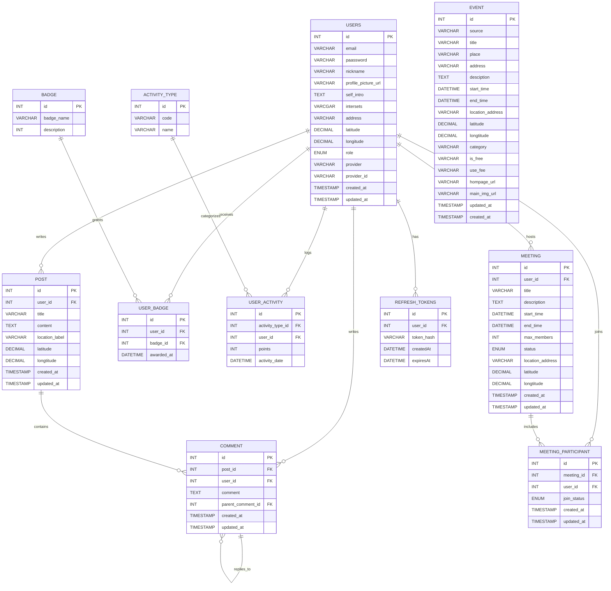

# 이벤트있다 Eventitta
- 이벤트있다(Eventitta)는 지역 기반 소셜 커뮤니티 플랫폼으로, 온라인 상에서 지역 주민들이 서로의 관심사와 정보를 공유하고,
- 이를 바탕으로 오프라인 이벤트나 모임으로 자연스럽게 연결될 수 있는 환경을 제공하는 서비스입니다.
## 1. 프로젝트 개요

* **제작 기간**: 2025-04-27 \~ (진행 중)
* **참여 인원**: 1명 (개인 프로젝트)
* **프로젝트 설명**:

## 2. 사용 기술 스택

### Back-end

* Java 17, Spring Boot 3.4.5, Gradle
* Spring Data JPA, MySQL

## 3. 아키텍처 설계

## 4. 도메인 모델

## 5. 차트 & 다이어그램

  
 ERD 보기/숨기기

 

## 6. 핵심 기능

## 7. Technical Issues & 고민 사항
- 인증/인가 구현: 세션, 토큰 방식
- Geo 검색 (위경도 기반 범위·거리 조회)

## 8. 트러블 슈팅

