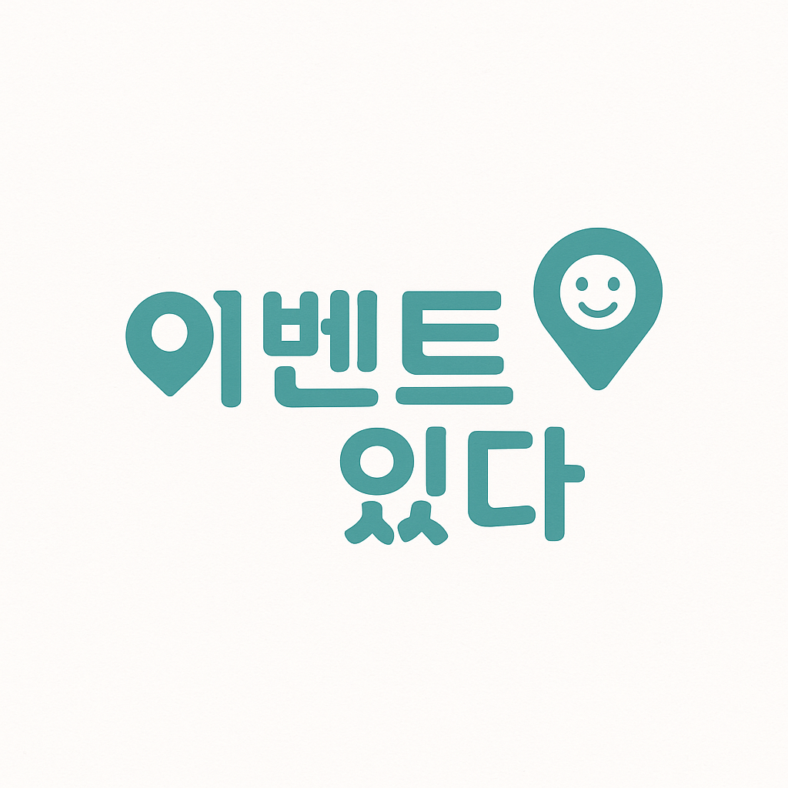
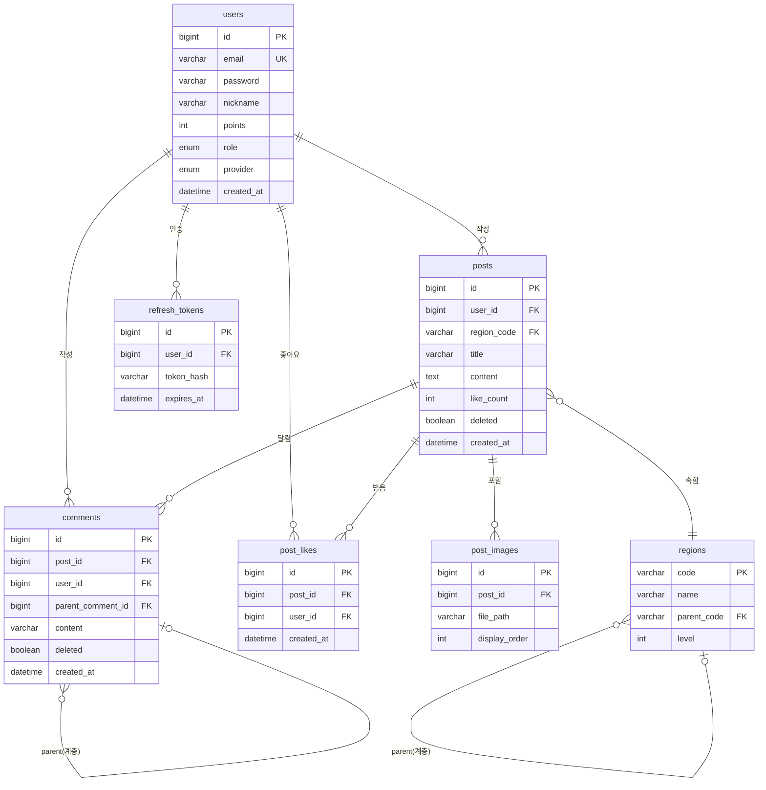
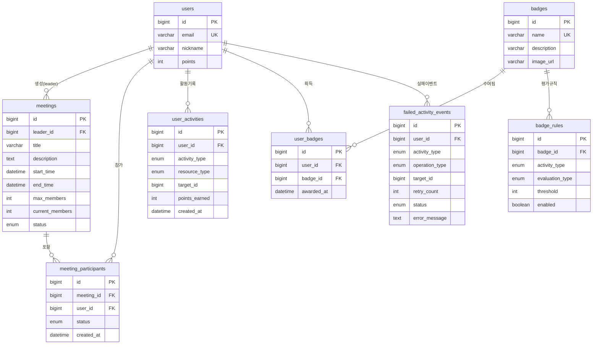
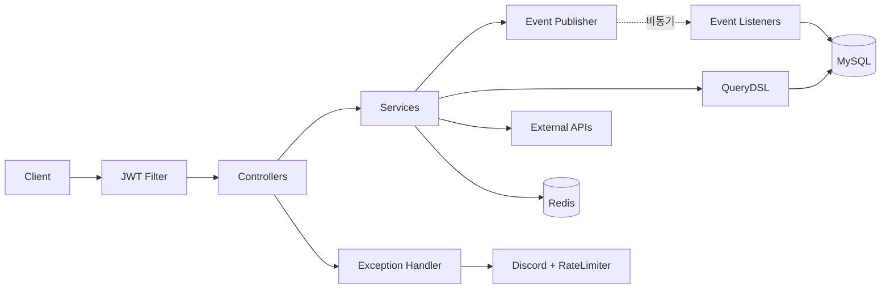
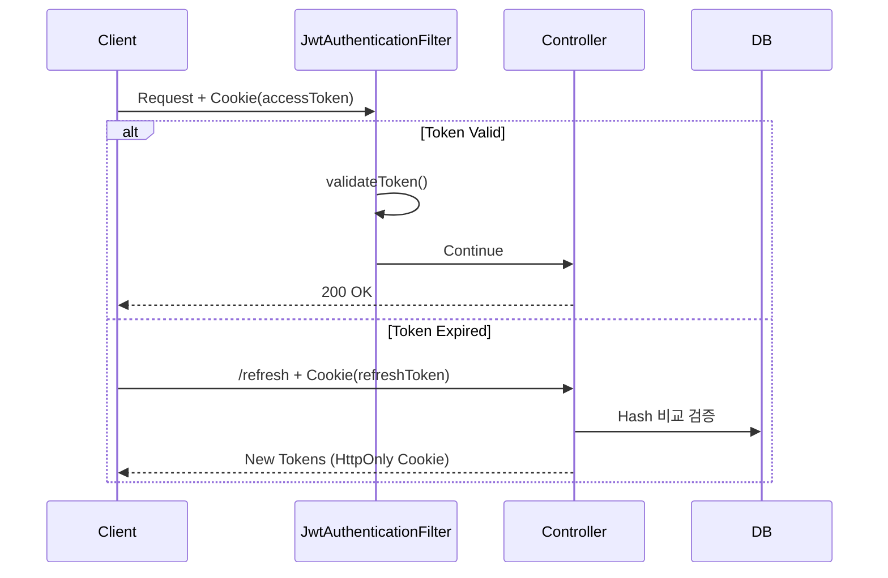

<div align="center">
  
  <h1>Eventitta</h1>
  <p><strong>지역 기반 소셜 커뮤니티 플랫폼</strong></p>
  <p>이벤트 기반 게임화 시스템, 외부 API 자동 동기화, 동적 검색 쿼리 최적화</p>
  <p>
    <a href="https://openjdk.org/"></a>
    <a href="https://spring.io/projects/spring-boot"></a>
    <a href="https://www.mysql.com/"></a>
    <a href="build/reports/tests/test/index.html"></a>
    <a href="http://localhost:8080/swagger-ui.html"></a>
  </p>
</div>

---

## 목차

- [프로젝트 개요](#프로젝트-개요)
- [ERD (Entity Relationship Diagram)](#erd-entity-relationship-diagram)
- [배포 아키텍처](#배포-아키텍처)
- [핵심 기능](#핵심-기능)
- [기술적 하이라이트](#기술적-하이라이트)
- [시스템 아키텍처](#시스템-아키텍처)
- [품질 & 안정성](#품질--안정성)
- [빠른 시작](#빠른-시작)
- [문서](#문서)

---

## 프로젝트 개요

실제 운영 환경을 고려하여 설계한 지역 기반 커뮤니티 플랫폼입니다. 동시성 문제 해결, 이벤트 기반 아키텍처, 외부 API 연동 등 실무에서 직면하는 기술적 문제들을 직접 해결하며 구현했습니다.

| 구분           | 내용                                              |
|--------------|-------------------------------------------------|
| **개발 기간**    | 2025.07 - 2026.12 (5개월)                         |
| **기술 스택**    | Java 17, Spring Boot 3.4.5, JPA, QueryDSL 5.0.0 |
| **데이터베이스**   | MySQL 8.0 (운영), H2 (테스트)                        |
| **테스트**      | 단위/통합/동시성 테스트 446개                              |
| **인프라**      | Docker, GitHub Actions, AWS RDS, Nginx          |
| **주요 해결 과제** | 동시성 제어, 이벤트 신뢰성, N+1 문제, 분산 스케줄러                |

---

## ERD (Entity Relationship Diagram)

### 커뮤니티 핵심 엔티티



### 모임 & 게임화 시스템



---

## 배포 아키텍처

**운영 환경**: EC2 기반 Docker 컨테이너와 AWS RDS를 활용한 실제 프로덕션 배포 구조입니다.

### CI/CD 파이프라인


### 운영 환경

| 구성 요소             | 기술                      | 역할                |
|-------------------|-------------------------|-------------------|
| **CI/CD**         | GitHub Actions          | 자동 빌드/테스트/배포      |
| **컨테이너**          | Docker + Docker Compose | 애플리케이션 격리 및 배포    |
| **WAS**           | Spring Boot (Docker)    | 비즈니스 로직 처리        |
| **DB**            | AWS RDS (MySQL 8.0)     | 데이터 영속성           |
| **Reverse Proxy** | Nginx                   | 역방향 프록시, HTTPS 종료 |
| **스토리지**          | AWS S3                  | 이미지/파일 저장         |
| **모니터링**          | Discord Webhook         | 에러 알림, 배포 알림      |

### 무중단 배포

- **헬스체크 기반 배포**: Spring Boot Actuator `/actuator/health` 엔드포인트 활용
- **롤백 전략**: 이전 Docker 이미지로 즉시 전환 가능
- **배포 검증**: 실행 중인 컨테이너 이미지 태그 자동 확인

---

## 핵심 기능

- **커뮤니티**: 게시글/댓글, 좋아요, 이미지 업로드
- **모임 관리**: 생성/참가 신청/승인 워크플로우 (동시성 제어 적용)
- **축제 정보**: 서울시/전국 축제 API 연동 및 자동 동기화
- **게임화 시스템**: 사용자 활동 추적, 포인트/배지 자동 지급 (이벤트 기반)

---

## 기술적 하이라이트

| 챌린지               | 해결                                      | 결과                               |
|-------------------|-----------------------------------------|----------------------------------|
| **JWT 인증 보안**     | HttpOnly 쿠키 + Refresh Token 해시 저장       | XSS 방어, 토큰 탈취 시 피해 최소화           |
| **모임 참가 동시성**     | JPA 비관적 락 (`SELECT ... FOR UPDATE`)     | 정원 초과 승인 100% 방지, Lost Update 해결 |
| **포인트 동시성**       | Atomic Update 쿼리 (`u.points + :amount`) | 높은 동시성 유지하면서 포인트 유실 방지           |
| **트랜잭션 데드락**      | 이벤트 기반 아키텍처로 트랜잭션 분리                    | 락 보유 시간 90% 감소, 데드락 방지           |
| **실시간 랭킹 시스템**    | Redis Sorted Set + MySQL Fallback       | 조회 속도 100배 향상, 장애 자동 복구          |
| **비동기 이벤트 신뢰성**   | Retry + DB 저장 + 스케줄러 복구                 | 데이터 유실 방지, 자동 복구                 |
| **스케줄러 실패 격리**    | 개별 트랜잭션 처리 (`REQUIRES_NEW`)             | 배치 작업 중 개별 실패가 전체에 영향 없음         |
| **도메인 간 강결합**     | Spring Events + 비동기 처리                  | 핵심 도메인과 부가 기능 의존성 분리             |
| **분산 스케줄러 중복 실행** | ShedLock (JDBC 락)                       | 다중 인스턴스 환경 대비 단일 실행 보장           |
| **복잡한 검색 조건**     | QueryDSL 동적 쿼리 + Fetch Join             | N+1 문제 해결, 타입 안전 처리              |
| **Festival 거리 검색** | Bounding Box + 복합 인덱스 (Two-Phase Filtering) | 응답 시간 40-65% 개선, 스캔 레코드 90% 감소 |
| **Discord 알림 폭증** | Caffeine Cache 기반 Rate Limiter          | Alert Level별 차등 제한, 7가지 알고리즘 비교  |
| **Badge 평가 확장성**  | 전략 패턴 + EvaluationType 분리               | 새 평가 기준 추가 시 Evaluator만 구현       |

상세한 기술적 해결 과정은 [TECHNICAL_CHALLENGES.md](docs/TECHNICAL_CHALLENGES.md)에서 확인할 수 있습니다.

---

## 시스템 아키텍처

### 전체 시스템 구조



### JWT 인증 플로우



전체 아키텍처 설계와 도메인 구조는 [ARCHITECTURE.md](docs/ARCHITECTURE.md)에서 확인할 수 있습니다.

---

## 품질 & 안정성

- **테스트**: 446개 테스트 통과 (단위/통합/컨트롤러/동시성 테스트)
- **동시성 제어**: 비관적 락 + Atomic Update로 Race Condition 해결
- **이벤트 신뢰성**: Retry + DB 저장 + 스케줄러로 비동기 이벤트 자동 복구
- **쿼리 최적화**: QueryDSL + Fetch Join으로 N+1 문제 해결
- **외부 API 안정성**: Spring Retry로 일시적 오류 자동 복구 (3회, exponential backoff)
- **분산 환경**: ShedLock으로 스케줄러 중복 실행 방지
- **알림 관리**: Caffeine Cache 기반 Rate Limiter로 Discord 알림 폭증 방지

---

## 빠른 시작

```bash
# 1. MySQL 실행
cd infra && docker-compose up -d

# 2. 환경 변수 설정
export MYSQL_PASSWORD=your-password SECRET_KEY=your-jwt-secret

# 3. 애플리케이션 실행
./gradlew bootRun --args='--spring.profiles.active=local'

# 4. API 문서 확인
open http://localhost:8080/swagger-ui.html
```

---

## 문서

- [**시스템 아키텍처**](docs/ARCHITECTURE.md) - 전체 설계, DDD, 이벤트 기반 구조, JWT 인증
- [**기술적 챌린지**](docs/TECHNICAL_CHALLENGES.md) - 문제 해결 과정과 성과

---

### 기술 스택

- **Backend**: Java 17, Spring Boot 3.4.5, Spring Data JPA, QueryDSL 5.0.0
- **Security**: Spring Security, JWT (HttpOnly Cookie)
- **Database**: MySQL 8.0, Flyway Migration
- **Cache/Ranking**: Redis (Sorted Set 기반 실시간 랭킹)
- **Infrastructure**: Docker, GitHub Actions, AWS RDS, Nginx
- **Monitoring**: P6Spy, Spring Actuator, Discord Webhook
- **기타**: ShedLock (분산 락), Caffeine Cache, Spring Retry, Spring Events

### 버전 관리

- **v1.0** (2024.12): 커뮤니티, 모임 관리, 게임화 시스템, 축제 정보 연동 완료
- **v2.0** (2025.01): Redis 랭킹 시스템 도입, 트랜잭션 데드락 해결, 이벤트 기반 아키텍처 개선
