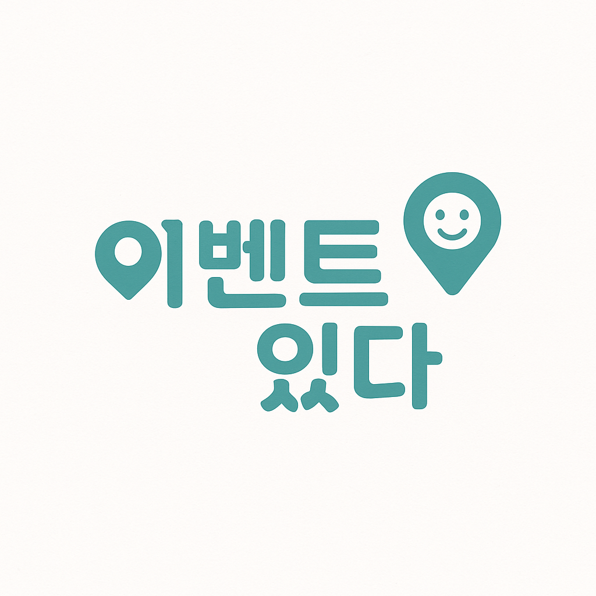
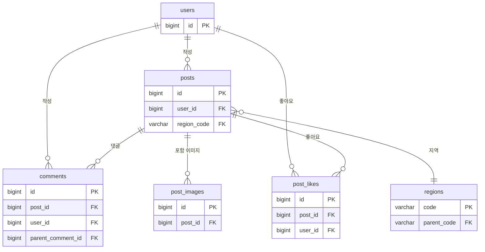
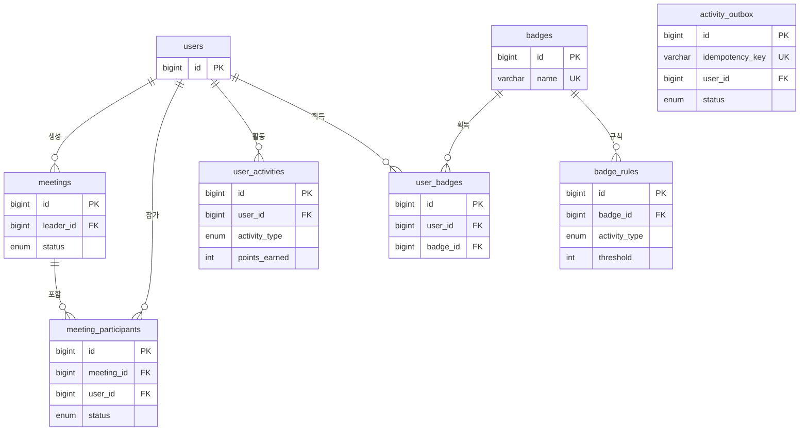
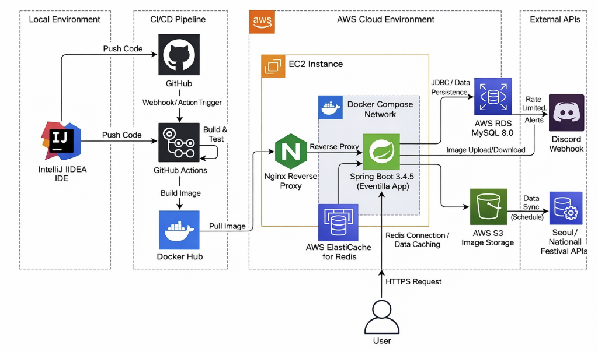
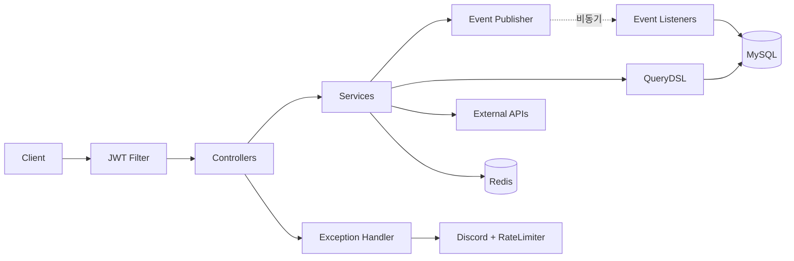

<div align="center">
  
  <h1>Eventitta</h1>
  <p><strong>지역 기반 소셜 커뮤니티 플랫폼</strong></p>
  <p>
    <a href="https://openjdk.org/"></a>
    <a href="https://spring.io/projects/spring-boot"></a>
    <a href="https://www.mysql.com/"></a>
    <a href="build/reports/tests/test/index.html"></a>
    <a href="http://localhost:8080/swagger-ui.html"></a>
  </p>
</div>

---

## 프로젝트 개요

| 구분 | 내용 |
|------|------|
| **개발 기간** | 2025.07 - 2025.12 (6개월) |
| **기술 스택** | Java 17, Spring Boot 3.4.5, JPA, QueryDSL 5.0.0 |
| **데이터베이스** | MySQL 8.0, Redis (랭킹), H2 (테스트) |
| **인프라** | Docker, GitHub Actions, AWS RDS, Nginx |

### 핵심 기능

- **커뮤니티**: 게시글/댓글, 좋아요, 이미지 업로드
- **모임 관리**: 생성/참가 신청/승인 워크플로우
- **축제 정보**: 서울시/전국 축제 API 연동 및 자동 동기화
- **게임화 시스템**: 활동 추적, 포인트/배지 자동 지급

---

## ERD

### 커뮤니티 (게시글 / 댓글 / 좋아요)


```mermaid
erDiagram
  users ||--o{ posts : "작성"
  users ||--o{ comments : "작성"
  users ||--o{ post_likes : "좋아요"
  posts ||--o{ comments : "댓글"
  posts ||--o{ post_images : "포함 이미지"
  posts ||--o{ post_likes : "좋아요"
  posts }o--|| regions : "지역"

  users {
    bigint id PK
  }
  posts {
    bigint id PK
    bigint user_id FK
    varchar region_code FK
  }
  comments {
    bigint id PK
    bigint post_id FK
    bigint user_id FK
    bigint parent_comment_id FK
  }
  post_images {
    bigint id PK
    bigint post_id FK
  }
  post_likes {
    bigint id PK
    bigint post_id FK
    bigint user_id FK
  }
  regions {
    varchar code PK
    varchar parent_code FK
  }
```

### 모임 & 게임화 시스템


```mermaid
erDiagram
  users ||--o{ meetings : "생성"
  users ||--o{ meeting_participants : "참가"
  users ||--o{ user_activities : "활동"
  users ||--o{ user_badges : "획득"
  meetings ||--o{ meeting_participants : "포함"
  badges ||--o{ user_badges : "획득"
  badges ||--o{ badge_rules : "규칙"

  users {
    bigint id PK
  }
  meetings {
    bigint id PK
    bigint leader_id FK
    enum status
  }
  meeting_participants {
    bigint id PK
    bigint meeting_id FK
    bigint user_id FK
    enum status
  }
  user_activities {
    bigint id PK
    bigint user_id FK
    enum activity_type
    int points_earned
  }
  badges {
    bigint id PK
    varchar name UK
  }
  user_badges {
    bigint id PK
    bigint user_id FK
    bigint badge_id FK
  }
  badge_rules {
    bigint id PK
    bigint badge_id FK
    enum activity_type
    int threshold
  }
  activity_outbox {
    bigint id PK
    varchar idempotency_key UK
    bigint user_id FK
    enum status
  }
```

---

## 배포 아키텍처

### CI/CD 파이프라인



| 구성 요소 | 기술 | 역할 |
|-----------|------|------|
| **CI/CD** | GitHub Actions | 자동 빌드/테스트/배포 |
| **컨테이너** | Docker + Docker Compose | 애플리케이션 격리 및 배포 |
| **DB** | AWS RDS (MySQL 8.0) | 데이터 영속성 |
| **Reverse Proxy** | Nginx | HTTPS 종료, 역방향 프록시 |
| **스토리지** | AWS S3 | 이미지/파일 저장 |
| **모니터링** | Discord Webhook | 에러/배포 알림 |

---

## 기술적 하이라이트

| 챌린지 | 해결 | 결과 |
|--------|------|------|
| **동시성 제어** | 비관적 락(모임) + Atomic Update(포인트) 전략 분리 | 정원 초과·포인트 유실 방지 |
| **이벤트 기반 아키텍처** | Spring Events → Retry+DB → Transactional Outbox 진화 | 데드락 해결, 이벤트 유실 방지, 배치 실패 격리 |
| **N+1 + 동적 검색** | QueryDSL fetchJoin + Projection DTO | N+1 해결, 동적 필터, 필요 컬럼만 조회 |
| **JWT 인증 보안** | HttpOnly + SameSite=Strict + RT PBKDF2 해시 저장 | XSS/CSRF 방어, DB 탈취 대응 |
| **실시간 랭킹** | Redis Sorted Set + MySQL Fallback | O(log N) 업데이트, 장애 시 자동 전환 |

→ 상세: [TECHNICAL_CHALLENGES.md](docs/TECHNICAL_CHALLENGES.md)

---

## 시스템 아키텍처


```mermaid
graph LR
  A[Client] --> B[JWT Filter]
  B --> C[Controllers]
  C --> D[Services]
  D --> E[Event Publisher]
  E -. 비동기 .-> F[Event Listeners]
  D --> G[QueryDSL]
  G --> H[(MySQL)]
  F --> H
  D --> I[External APIs]
  D --> R[(Redis)]
  C --> J[Exception Handler]
  J --> K[Discord + RateLimiter]
```

→ 상세: [ARCHITECTURE.md](docs/ARCHITECTURE.md)

---

## 빠른 시작

```bash
# 1. MySQL 실행
cd infra && docker-compose up -d

# 2. 환경 변수 설정
export MYSQL_PASSWORD=your-password SECRET_KEY=your-jwt-secret

# 3. 애플리케이션 실행
./gradlew bootRun --args='--spring.profiles.active=local'

# 4. API 문서 확인
open http://localhost:8080/swagger-ui.html
```

---

## 기술 스택

- **Backend**: Java 17, Spring Boot 3.4.5, Spring Data JPA, QueryDSL 5.0.0
- **Security**: Spring Security, JWT (HttpOnly Cookie)
- **Database**: MySQL 8.0, Flyway Migration
- **Cache/Ranking**: Redis (Sorted Set), Caffeine Cache
- **Infrastructure**: Docker, GitHub Actions, AWS RDS, Nginx
- **기타**: ShedLock, Spring Retry, Spring Events, Discord Webhook
