# 아키텍처 설계

## 시스템 아키텍처

```mermaid
graph TB
    subgraph "Client Layer"
        A[Web Client]
    end

    subgraph "API Layer"
        B[Spring Security<br/>JWT Filter]
        C[REST Controllers]
        D[Global Exception Handler]
    end

    subgraph "Service Layer"
        E[Domain Services]
        F[Event Publisher]
        G[Event Listeners<br/>@Async]
        AP[ActivityPostProcessor<br/>@Async]
    end

    subgraph "Data Layer"
        H[Spring Data JPA]
        I[QueryDSL<br/>Custom Repositories]
        J[(MySQL)]
        RD[(Redis<br/>Sorted Set)]
    end

    subgraph "External Layer"
        K[Seoul Festival API]
        L[National Festival API]
        M[Nominatim Geocoding]
        N[Discord Webhook]
    end

    subgraph "Infrastructure"
        O[Caffeine Cache]
        P[ShedLock<br/>Distributed Lock]
        Q[Schedulers]
        R[Rate Limiter]
    end

    A --> B
    B --> C
    C --> E
    E --> F
    F -.-> G
    F -.-> AP
    E --> H
    E --> I
    E --> RD
    H --> J
    I --> J
    G --> H
    AP --> H
    AP --> RD
    Q --> P
    Q --> K
    Q --> L
    E --> M
    D --> N
    D --> R
    E --> O
```

## 도메인 주도 설계

### 패키지 구조

각 도메인은 독립적인 패키지 구조를 가지며, 명확한 책임 분리를 따릅니다:

```
com.eventitta/
├── auth/              # JWT 인증/인가
│   ├── domain/
│   ├── service/
│   ├── controller/
│   ├── jwt/           # JWT 유틸리티, 필터
│   ├── properties/    # JwtProperties, CookieProperties
│   └── exception/
│
├── post/              # 게시글 도메인
│   ├── domain/        # Post 엔티티
│   ├── repository/    # PostRepository + Custom 구현
│   ├── service/       # PostService
│   ├── controller/    # PostController
│   ├── dto/
│   │   ├── request/   # CreatePostRequest, UpdatePostRequest
│   │   ├── response/  # PostDetailResponse, PostSummaryResponse
│   │   └── projection/# PostProjection (QueryDSL)
│   └── exception/     # PostErrorCode
│
├── comment/           # 계층형 댓글
│   └── ...
│
├── meeting/           # 모임 관리 (동시성 제어 적용)
│   ├── domain/        # Meeting, MeetingParticipant
│   ├── repository/    # 비관적 락 쿼리 포함
│   └── ...
│
├── gamification/      # 게임화 시스템 (이벤트 기반)
│   ├── domain/        # UserActivity, Badge, ActivityType
│   ├── event/         # UserActivityEventListener
│   └── evaluator/     # BadgeEvaluator 구현체들
│
├── festivals/         # 축제 정보 + 외부 API
│   ├── dto/
│   │   ├── external/
│   │   │   ├── seoul/      # SeoulFestivalResponse
│   │   │   ├── national/   # NationalFestivalResponse
│   │   │   └── geocoding/  # Coordinates
│   │   ├── request/
│   │   ├── response/
│   │   └── projection/
│   └── properties/    # SeoulFestivalProperties, NationalFestivalProperties
│
├── notification/      # Slack 알림 (Rate Limiting)
│   ├── domain/        # AlertLevel, SlackMessage
│   ├── service/       # SlackNotificationService
│   ├── service/ratelimit/  # 7가지 Rate Limiter 구현
│   ├── resolver/      # AlertLevelResolver
│   ├── properties/    # SlackProperties
│   └── exception/
│
└── common/            # 공통 설정/예외 처리
    ├── config/
    │   ├── async/         # AsyncConfig
    │   ├── jpa/           # JpaAuditingConfig, QuerydslConfig
    │   ├── scheduling/    # SchedulingConfig, ShedLockConfig
    │   └── web/           # OpenApiConfig, RestClientConfig
    ├── domain/        # BaseEntity, BaseUserEntity, BaseTimeEntity
    ├── exception/     # GlobalExceptionHandler, CustomException
    └── interceptor/   # ResponseTimeFilter
```

### 도메인 독립성

- **notification**은 독립적인 도메인으로, 크로스 커팅 알림 기능 제공
- 각 도메인은 자체 `properties/` 패키지를 가질 수 있음 (도메인별 설정)
- Base 엔티티는 `common/domain/`에서 관리 (명확성)

## 엔티티 상속 구조

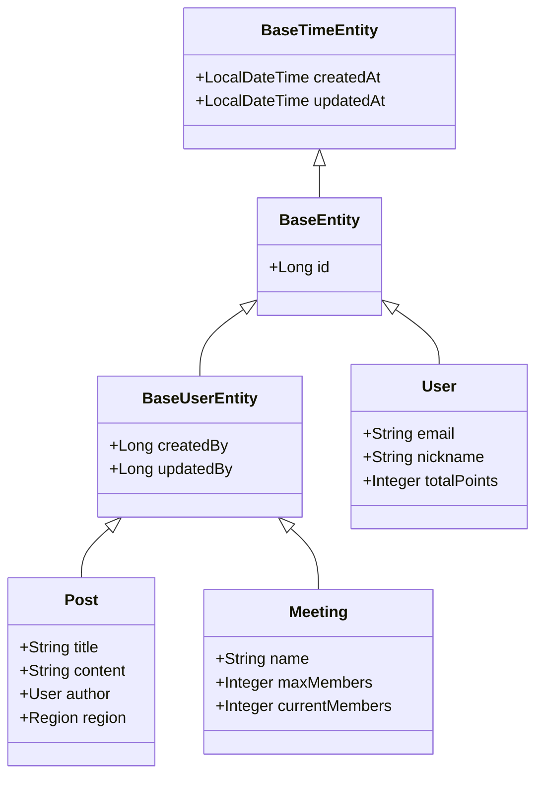

### Base 엔티티 계층

- **BaseTimeEntity**: `createdAt`, `updatedAt` (JPA Auditing)
- **BaseEntity**: `id` 필드 추가
- **BaseUserEntity**: `createdBy`, `updatedBy` 추가 (사용자 추적)

## 인증/인가 아키텍처

### JWT 기반 인증 플로우

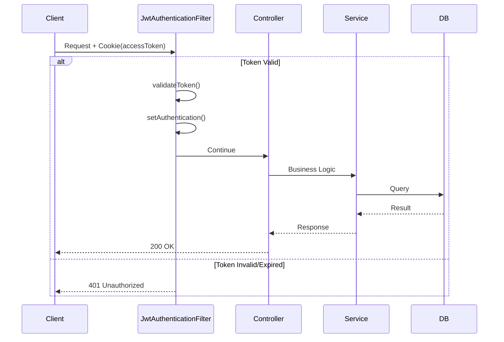

### 토큰 재발급 플로우

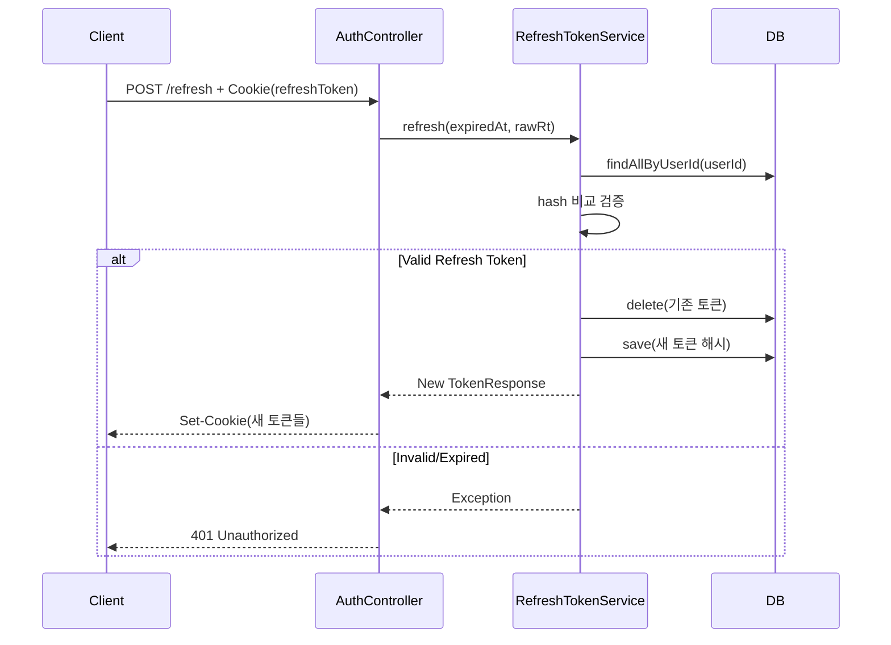

### 토큰 관리 전략

| 항목 | Access Token | Refresh Token |
|------|-------------|---------------|
| **유효기간** | 1시간 | 24시간 |
| **저장 위치** | HttpOnly Cookie | HttpOnly Cookie |
| **서버 저장** | 없음 (Stateless) | 해시값만 DB 저장 |
| **보안** | XSS 방어 (HttpOnly) | 탈취 대응 (해시 저장) |

### 보안 기능

1. **JWT + HttpOnly Cookie**: XSS 방어
2. **Refresh Token 해시 저장**: DB 탈취 대응
3. **일회용 토큰 정책**: 세션 하이재킹 방지
4. **BCrypt**: 비밀번호 해싱 (Strength 10)
5. **SQL Injection 방지**: QueryDSL + PreparedStatement

### 권한 제어

```java
http
    .authorizeHttpRequests(auth -> auth
        .requestMatchers("/api/v1/auth/**").permitAll()
        .anyRequest().authenticated()
    )
```

## 동시성 제어 전략

### 비관적 락 적용 (모임 참가 승인)

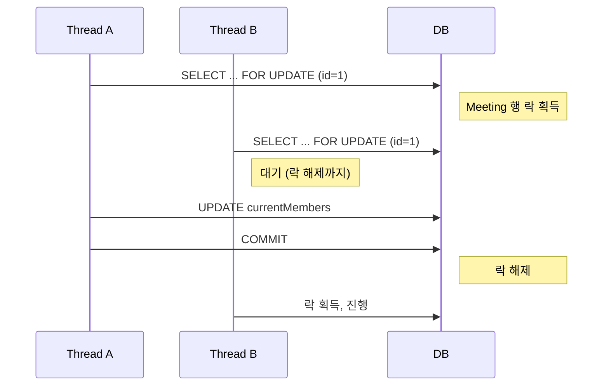

### 락 구현

```java
public interface MeetingRepository extends JpaRepository<Meeting, Long> {
    @Lock(LockModeType.PESSIMISTIC_WRITE)
    @QueryHints({
        @QueryHint(name = "jakarta.persistence.lock.timeout", value = "3000")
    })
    @Query("SELECT m FROM Meeting m WHERE m.id = :id")
    Optional<Meeting> findByIdForUpdate(@Param("id") Long id);
}
```

### 동시성 제어 전략 비교

| 전략 | 사용 케이스 | 장점 | 단점 |
|------|------------|------|------|
| **비관적 락** | 모임 참가 승인 | 데이터 정합성 보장 | 동시 처리량 감소 |
| **낙관적 락** | 게시글 수정 | 높은 동시성 | 충돌 시 재시도 필요 |
| **ShedLock** | 스케줄러 | 분산 환경 지원 | 단일 실행만 보장 |

## 이벤트 기반 아키텍처

### 게임화 시스템 이벤트 플로우

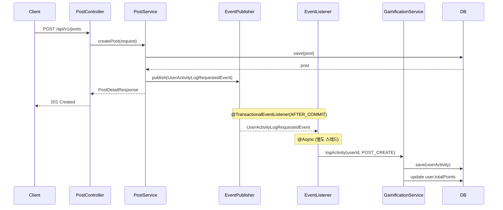

### 핵심 특징

1. **비동기 처리**: `@Async` + 전용 스레드 풀
2. **트랜잭션 분리**: `@TransactionalEventListener(AFTER_COMMIT)` - 메인 트랜잭션과 독립
3. **도메인 디커플링**: `PostService`는 `GamificationService`를 알지 못함

### 이벤트 실패 복구 플로우

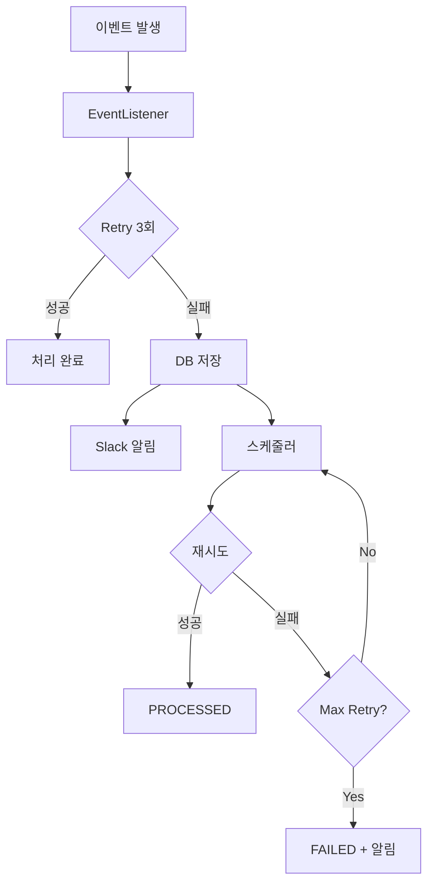

### 실패 이벤트 상태 흐름

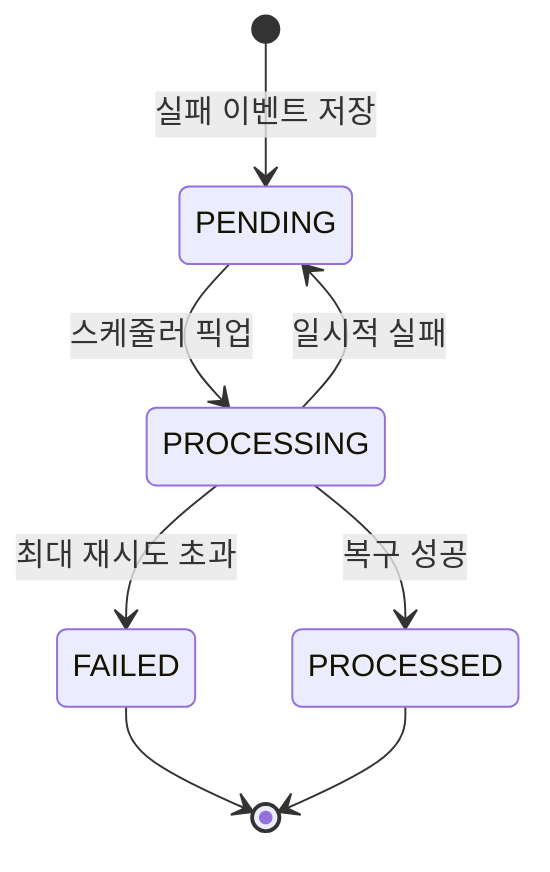

## Badge 평가 시스템 (전략 패턴)

### 구조

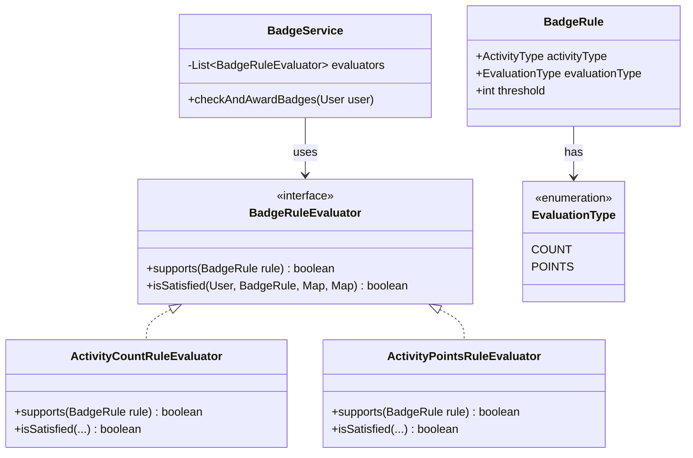

### 평가 플로우

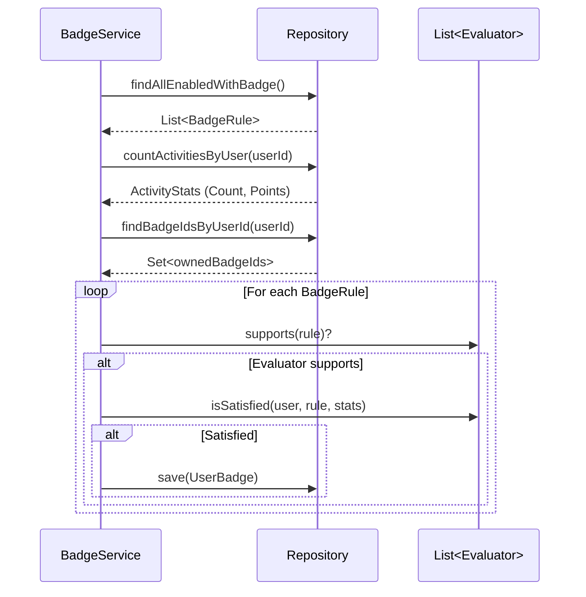

## 외부 API 연동 전략

### Retry & Circuit Breaker

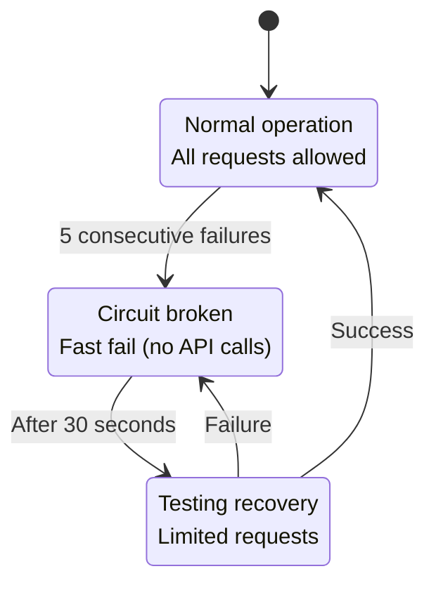

### 재시도 전략

```java
@Retryable(
    retryFor = {RestClientException.class},
    maxAttempts = 3,
    backoff = @Backoff(delay = 2000, multiplier = 2) // 2초 → 4초 → 8초
)
```

## 캐싱 전략

### Caffeine Cache 사용처

| 데이터 | TTL | 크기 | 이유 |
|--------|-----|------|------|
| 지역 데이터 | 30일 | 20개 | 거의 변하지 않음, 빈번한 조회 |
| Rate Limiter | 1분 | 1000개 | 알림 제한 추적 |

### 캐시 무효화 전략

- 지역 데이터: TTL 기반 자동 만료 (30일)
- Rate Limiter: TTL 기반 자동 만료 (1분)

## 스케줄러 설계

### ShedLock으로 분산 락 보장

```java
@Scheduled(cron = "0 0 3 * * *") // 매일 03:00
@SchedulerLock(
    name = "syncDailySeoulFestivalData",
    lockAtMostFor = "30s",  // 최대 락 시간
    lockAtLeastFor = "10s"   // 최소 락 시간
)
public void syncDailySeoulFestivalData() {
    // JDBC 기반 분산 락으로 단일 실행 보장
}
```

### 스케줄러 목록

| 스케줄러 | 실행 주기 | ShedLock | 목적 |
|----------|-----------|----------|------|
| FestivalScheduler (Seoul) | 매일 03:00 | ✅ | 서울시 축제 데이터 동기화 |
| FestivalScheduler (National) | 분기별 (1/4/7/10월 1일 02:00) | ✅ | 전국 축제 데이터 동기화 |
| MeetingStatusScheduler | 매 1분 | ✅ | 모임 상태 자동 업데이트 |
| TokenCleanupScheduler | 매 1시간 | ✅ | 만료된 Refresh Token 정리 |
| PostImageFileScheduler | 매일 04:00 | ✅ | 미사용 이미지 파일 정리 |
| FailedEventRecoveryScheduler | 매 5분 | ✅ | 실패한 활동 이벤트 재처리 |

## 모니터링 & 로깅

### P6Spy SQL 모니터링

- 모든 SQL 쿼리 로깅
- 실행 시간 측정
- 파라미터 바인딩 값 표시

### ResponseTimeFilter

- API 응답 시간 로깅
- 슬로우 쿼리 식별 (임계값: 1초)

### Slack 알림

- 에러 발생 시 자동 알림
- Alert Level 기반 차등 제한 (CRITICAL/HIGH/MEDIUM/INFO)
- Rate Limiting으로 스팸 방지

## DTO 조직화 원칙

### 표준 도메인 (auth, post, comment 등)

```
dto/
├── request/     # API 요청 DTO (CreatePostRequest, UpdatePostRequest)
├── response/    # API 응답 DTO (PostDetailResponse, PostSummaryResponse)
└── projection/  # QueryDSL 전용 (PostProjection, CommentFlatProjection)
```

### 외부 API 통합 도메인 (festivals)

```
dto/
├── external/
│   ├── seoul/      # 서울 Open API DTO
│   ├── national/   # 전국 축제 API DTO
│   └── geocoding/  # Nominatim Geocoding API DTO
├── request/        # 내부 API 요청
├── response/       # 내부 API 응답
└── projection/     # QueryDSL 프로젝션
```

### 네이밍 규칙

| 타입 | 패턴 | 예시 |
|------|------|------|
| Request | `{Action}{Domain}Request` | `CreateCommentRequest`, `UpdatePostRequest` |
| Response | `{Domain}{Detail}Response` | `PostDetailResponse`, `CommentWithChildrenResponse` |
| Projection | `{Domain}{Detail}Projection` | `CommentFlatProjection`, `ActivitySummaryProjection` |
| External | `external/{api-name}/*` | `external/seoul/SeoulFestivalResponse` |

## Redis 기반 실시간 랭킹 시스템

### 아키텍처

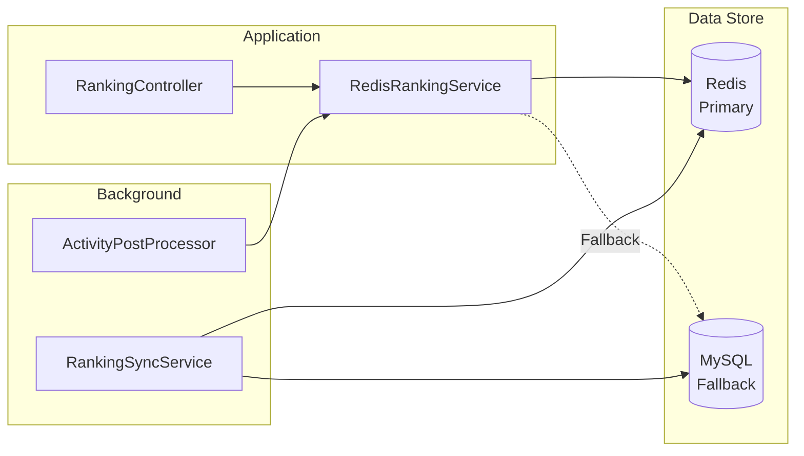

### 랭킹 시스템 설계

- **Redis Sorted Set**: 포인트/활동량 기준 실시간 랭킹
- **MySQL Fallback**: Redis 장애 시 자동 전환
- **데이터 동기화**: 주기적 MySQL → Redis 동기화
- **랭킹 타입**: `POINTS` (포인트 순위), `ACTIVITY_COUNT` (활동량 순위)

### 구현 특징

```java
// RedisRankingService - Fallback 전략
@Override
public RankingPageResponse getTopRankings(RankingType type, int limit) {
    try {
        return getTopRankingsFromRedis(type, limit);
    } catch (Exception e) {
        log.error("Redis failed, fallback to MySQL");
        return getTopRankingsFromDatabase(type, limit);
    }
}
```

## 트랜잭션 데드락 방지 아키텍처

### 문제 상황 (Before)

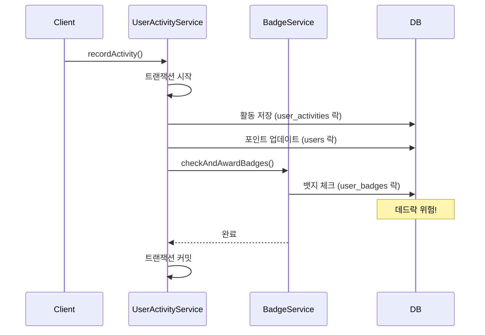

### 해결 방안 (After)

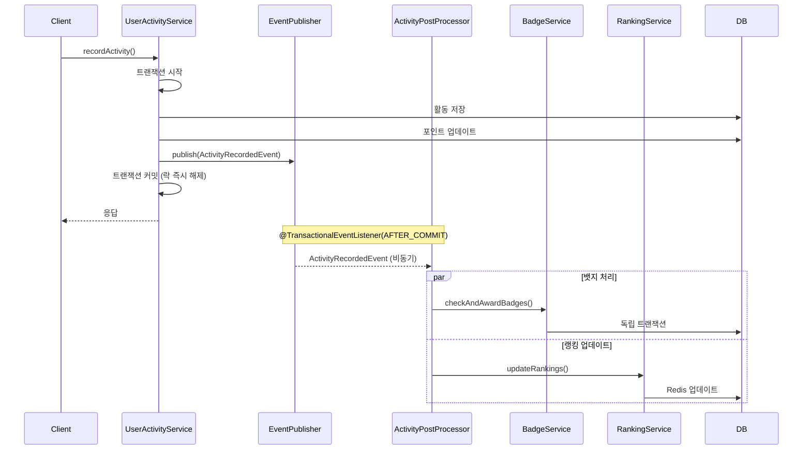

### 핵심 개선 사항

1. **트랜잭션 분리**: 핵심 작업과 부가 작업을 분리
2. **이벤트 기반 처리**: `ActivityRecordedEvent`로 느슨한 결합
3. **비동기 실행**: `ActivityPostProcessor`에서 별도 스레드로 처리
4. **개별 트랜잭션**: 스케줄러에서 `REQUIRES_NEW`로 실패 격리

### 성과

- **트랜잭션 시간**: 500ms → 50ms (90% 감소)
- **락 보유 시간**: 대폭 감소로 데드락 방지
- **처리량**: 2-3배 향상
- **장애 격리**: 뱃지/랭킹 실패가 핵심 기능에 영향 없음

## 실패 이벤트 복구 메커니즘

### 스케줄러 개별 트랜잭션 처리

```java
// FailedActivityEventRetryScheduler
@Scheduled(fixedDelay = 60000)
@SchedulerLock(name = "retryFailedActivityEvents")
@Transactional(propagation = NEVER)  // 스케줄러는 트랜잭션 없음
public void retryFailedEvents() {
    for (FailedActivityEvent event : eventsToProcess) {
        try {
            // 각 이벤트를 독립 트랜잭션으로 처리
            failedEventRecoveryService.recoverFailedEventIndependently(event.getId());
            successCount++;
        } catch (Exception e) {
            // 개별 실패가 다른 이벤트에 영향 없음
            log.warn("개별 이벤트 재처리 실패", e);
            failureCount++;
        }
    }
}

// FailedEventRecoveryService
@Transactional(propagation = Propagation.REQUIRES_NEW)  // 독립 트랜잭션
public void recoverFailedEventIndependently(Long eventId) {
    // 상태 체크 및 처리
}
```

---

**Last Updated**: 2025-01-08
