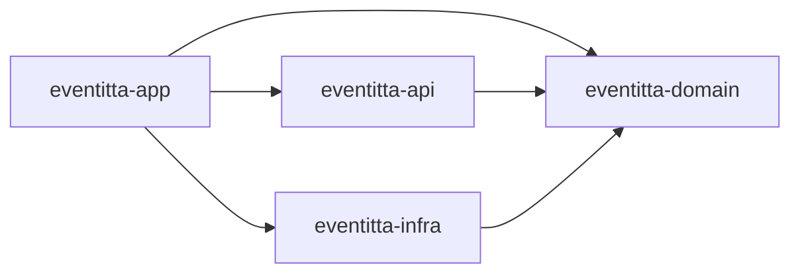
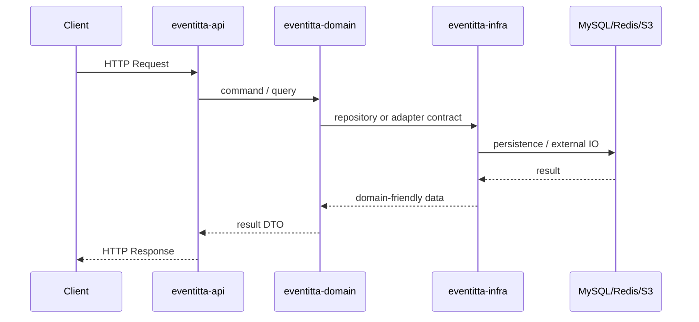

# Architecture

## Goal

이 프로젝트의 핵심 목표는 기능 수를 늘리는 것보다, 단일 백엔드 안에서 변경 영향 범위를 예측 가능한 구조로 관리하는 것이다.  
그래서 Eventitta는 단일 배포 단위를 유지하되 `app / api / domain / infra` 모듈로 경계를 물리적으로 강제하는 modular monolith로 정리했다.

## Module Layout

| 모듈 | 책임 |
| --- | --- |
| `eventitta-app` | 애플리케이션 부트스트랩, 모듈 조립, ArchUnit 규칙 |
| `eventitta-api` | controller, security filter, request/response DTO, web adapter |
| `eventitta-domain` | 도메인 모델, use case service, repository contract, internal facade |
| `eventitta-infra` | JPA/Redis/S3 구현, 외부 API adapter, scheduler |

의존 방향은 아래와 같이 고정한다.


```mermaid
graph LR
  app["eventitta-app"] --> api["eventitta-api"]
  app --> domain["eventitta-domain"]
  app --> infra["eventitta-infra"]
  api --> domain
  infra --> domain
```

- `domain`은 `api`, `infra`, `app`를 참조하지 않는다.
- 도메인 간 상호작용은 repository 직접 참조 대신 internal facade로 제한한다.
- `eventitta-app`에는 새 비즈니스 로직을 두지 않는다.

## Slice Pattern

기능은 공통적으로 아래 구조를 따른다.

```text
eventitta-api/src/main/java/com/eventitta/api/<slice>
eventitta-domain/src/main/java/com/eventitta/domain/<slice>
eventitta-infra/src/main/java/com/eventitta/infra/<slice>
```

예시:

- `auth`: JWT, 쿠키, 세션 관리
- `post`, `comment`: 커뮤니티
- `meeting`: 모임 생성/참가/승인
- `gamification`: 포인트, 활동 집계, 랭킹
- `media`, `file`: 업로드, 저장소, 이미지 처리

## Internal Facade Rule

다른 도메인의 엔티티나 repository를 직접 보는 대신, 필요한 데이터와 행위를 facade로 노출한다.

예를 들면:

- `UserInternalFacade`: 활성 사용자 검증, 프로필 조회
- `RegionInternalFacade`: 지역 존재 검증
- `PostInternalFacade`: 게시글 존재 검증, 작성자 조회, 미디어 참조 여부 확인
- `GamificationInternalFacade`: 게시글/댓글/모임 활동 적립 및 제거
- `AuthUserLifecycleFacade`: 사용자 비밀번호 변경/탈퇴 시 세션과 identity 정리
- `MeetingUserLifecycleFacade`: 사용자 탈퇴 시 모임 참가 정리

이 패턴 덕분에 `user -> auth`, `user -> meeting`, `media -> post` 같은 직접 의존을 제거할 수 있었다.

## Request Flow


```mermaid
sequenceDiagram
    participant Client
    participant API as eventitta-api
    participant Domain as eventitta-domain
    participant Infra as eventitta-infra
    participant DB as MySQL/Redis/S3

    Client->>API: HTTP Request
    API->>Domain: command / query
    Domain->>Infra: repository or adapter contract
    Infra->>DB: persistence / external IO
    DB-->>Infra: result
    Infra-->>Domain: domain-friendly data
    Domain-->>API: result DTO
    API-->>Client: HTTP Response
```

## Concurrency Strategy

같은 동시성 문제라도 패턴이 다르면 전략을 다르게 적용했다.

- 모임 승인: `SELECT ... FOR UPDATE` 기반 비관적 락
- 포인트/카운터 증감: 원자적 SQL update
- Redis 랭킹: 장애 시 MySQL fallback

이유와 구현 비교는 [TECHNICAL_CHALLENGES.md](./TECHNICAL_CHALLENGES.md)에 정리했다.

## Test Ownership

- `eventitta-app`: ArchUnit과 조립 관점 테스트만 유지
- `eventitta-api`: controller / security / web slice test
- `eventitta-domain`: 도메인 규칙과 서비스 단위 test
- `eventitta-infra`: repository, adapter, scheduler, storage test

현재 기준 검증 커맨드는 아래 두 가지다.

```bash
./gradlew testClasses
./gradlew test
```
