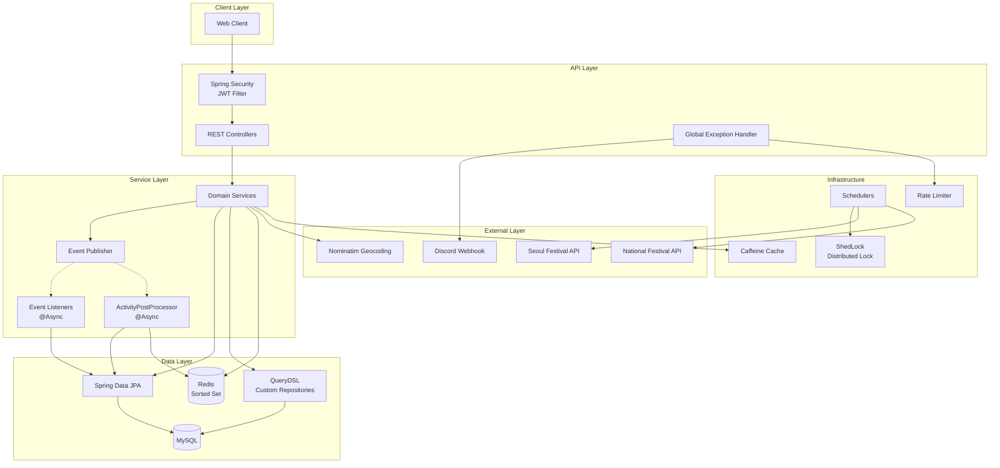
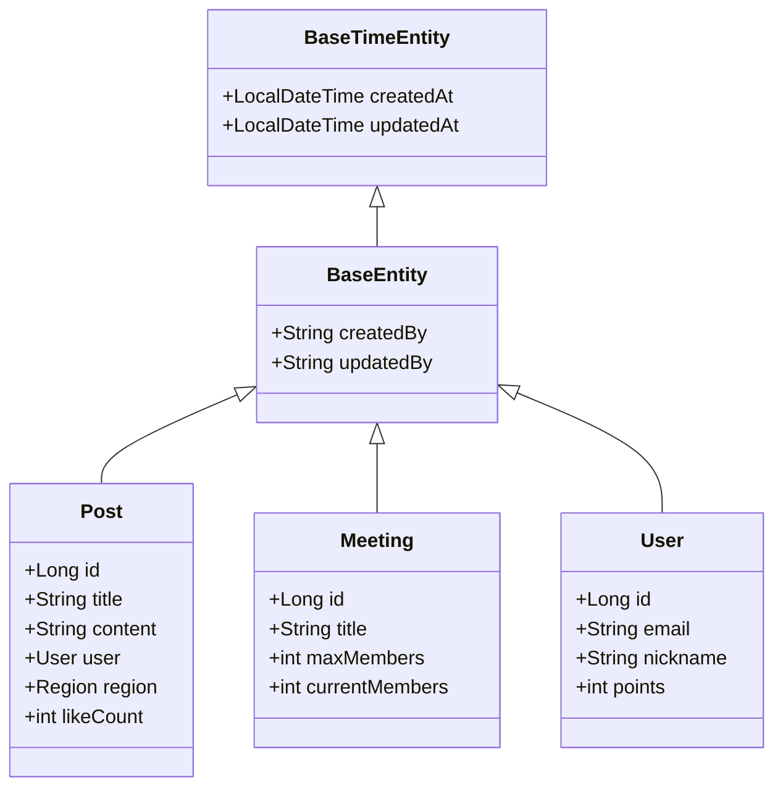
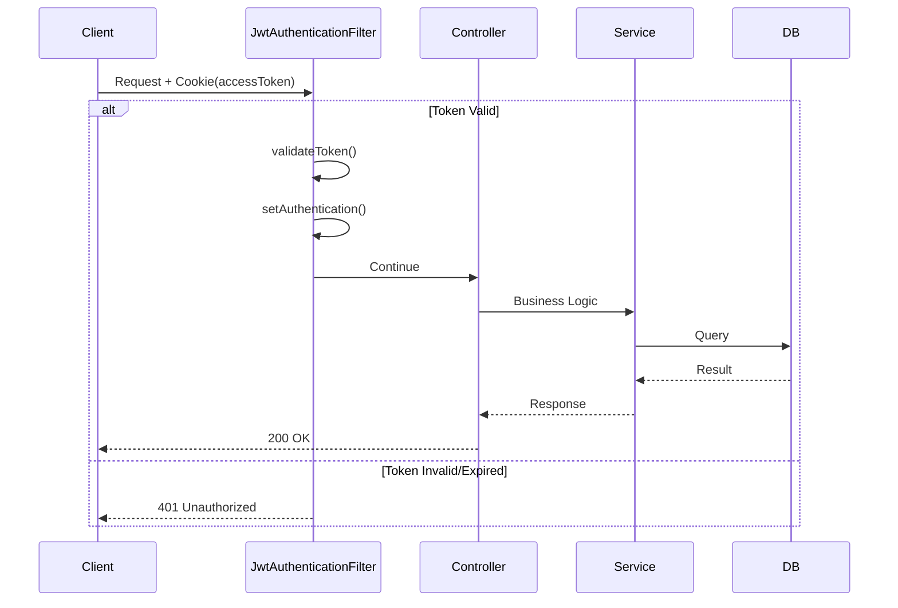
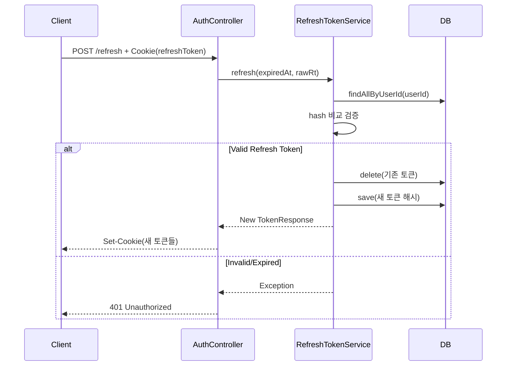
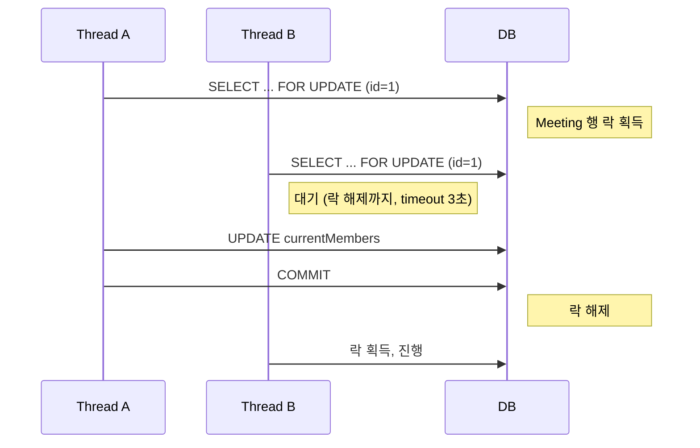
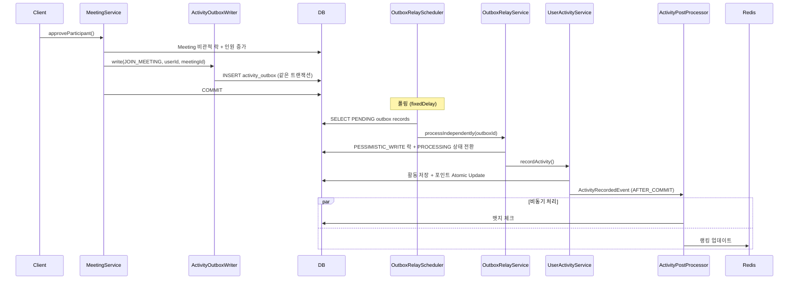
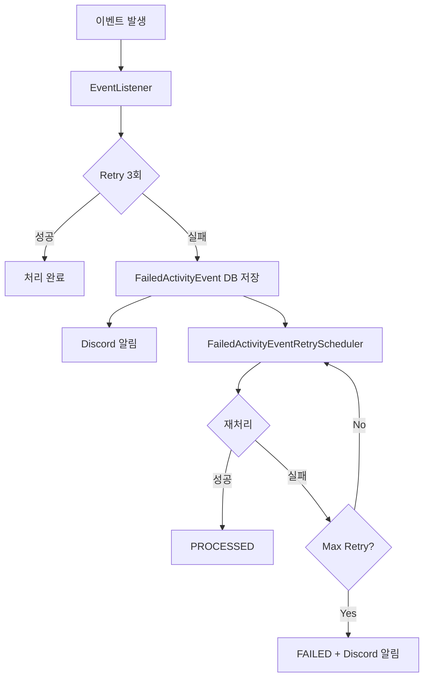
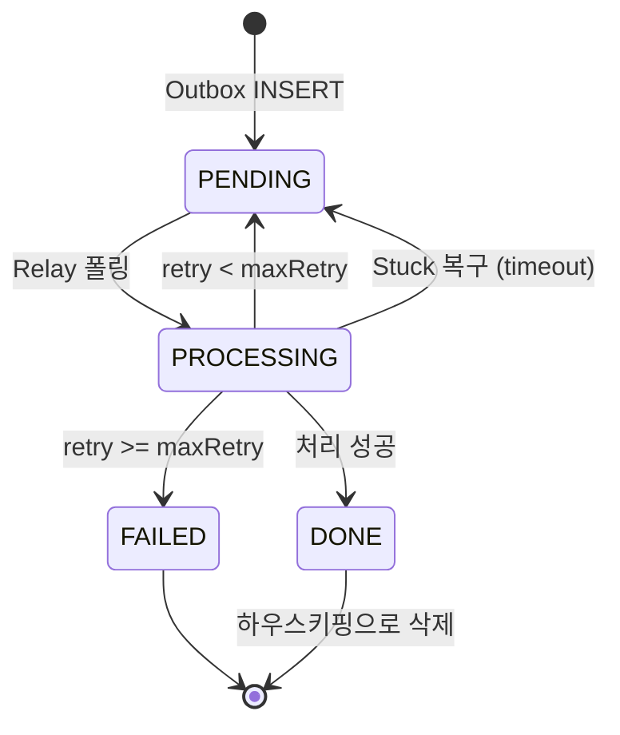
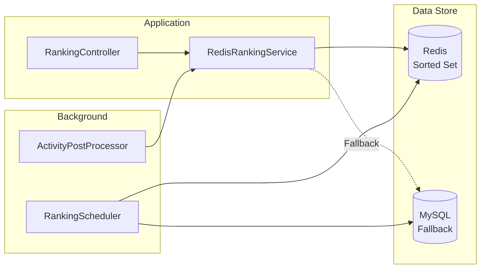
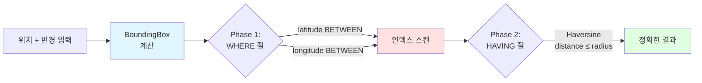

# 아키텍처 설계

## 시스템 아키텍처


```mermaid
graph TB
    subgraph "Client Layer"
        A[Web Client]
    end

    subgraph "API Layer"
        B[Spring Security<br>JWT Filter]
        C[REST Controllers]
        D[Global Exception Handler]
    end

    subgraph "Service Layer"
        E[Domain Services]
        F[Event Publisher]
        G["Event Listeners<br>@Async"]
        AP["ActivityPostProcessor<br>@Async"]
    end

    subgraph "Data Layer"
        H[Spring Data JPA]
        I[QueryDSL<br>Custom Repositories]
        J[(MySQL)]
        RD[(Redis<br>Sorted Set)]
    end

    subgraph "External Layer"
        K[Seoul Festival API]
        L[National Festival API]
        M[Nominatim Geocoding]
        N[Discord Webhook]
    end

    subgraph "Infrastructure"
        O[Caffeine Cache]
        P[ShedLock<br>Distributed Lock]
        Q[Schedulers]
        R[Rate Limiter]
    end

    A --> B
    B --> C
    C --> E
    E --> F
    F -.-> G
    F -.-> AP
    E --> H
    E --> I
    E --> RD
    H --> J
    I --> J
    G --> H
    AP --> H
    AP --> RD
    Q --> P
    Q --> K
    Q --> L
    E --> M
    D --> N
    D --> R
    E --> O
```

## 도메인 주도 설계

### 패키지 구조

각 도메인은 독립적인 패키지 구조를 가지며, 명확한 책임 분리를 따릅니다:

```
com.eventitta/
├── auth/              # JWT 인증/인가
│   ├── domain/
│   ├── service/
│   ├── controller/
│   ├── jwt/           # JWT 유틸리티, 필터
│   └── exception/
│
├── post/              # 게시글 도메인
│   ├── domain/        # Post 엔티티
│   ├── repository/    # PostRepository + QueryDSL 구현
│   ├── service/
│   ├── controller/
│   └── dto/
│
├── comment/           # 계층형 댓글
│
├── meeting/           # 모임 관리 (동시성 제어 적용)
│   ├── domain/        # Meeting, MeetingParticipant
│   ├── repository/    # 비관적 락 쿼리 포함
│   └── ...
│
├── gamification/      # 게임화 시스템 (이벤트 기반 + Outbox)
│   ├── domain/        # UserActivity, Badge, ActivityOutbox
│   ├── event/         # UserActivityEventListener, ActivityPostProcessor
│   ├── scheduler/     # OutboxRelayScheduler, FailedActivityEventRetryScheduler
│   └── evaluator/     # BadgeEvaluator 구현체들
│
├── festivals/         # 축제 정보 + 외부 API
│   ├── dto/external/  # SeoulFestival, NationalFestival, Geocoding DTO
│   └── util/          # BoundingBoxCalculator
│
├── notification/      # Discord 알림 (Rate Limiting)
│   ├── domain/        # AlertLevel
│   ├── service/       # DiscordNotificationService
│   └── service/ratelimit/  # Rate Limiter 구현체
│
└── common/            # 공통 설정/예외 처리
    ├── config/
    │   ├── async/         # AsyncConfig
    │   ├── jpa/           # JpaAuditingConfig, QuerydslConfig
    │   ├── scheduling/    # SchedulingConfig, ShedLockConfig
    │   └── web/           # OpenApiConfig, RestClientConfig
    ├── domain/        # BaseEntity, BaseTimeEntity
    ├── exception/     # GlobalExceptionHandler, CustomException
    └── util/          # CookieUtil
```

## 엔티티 상속 구조


```mermaid
classDiagram
    class BaseTimeEntity {
        +LocalDateTime createdAt
        +LocalDateTime updatedAt
    }

    class BaseEntity {
        +String createdBy
        +String updatedBy
    }

    class Post {
        +Long id
        +String title
        +String content
        +User user
        +Region region
        +int likeCount
    }

    class User {
        +Long id
        +String email
        +String nickname
        +int points
    }

    class Meeting {
        +Long id
        +String title
        +int maxMembers
        +int currentMembers
    }

    BaseTimeEntity <|-- BaseEntity
    BaseEntity <|-- Post
    BaseEntity <|-- Meeting
    BaseEntity <|-- User
```

### Base 엔티티 계층

- **BaseTimeEntity**: `createdAt`, `updatedAt` (JPA Auditing)
- **BaseEntity**: `BaseTimeEntity` 상속 + `createdBy`(String), `updatedBy`(String) 추가
- 각 엔티티는 `@Id` 필드를 직접 선언

## 인증/인가 아키텍처

### JWT 기반 인증 플로우


```mermaid
sequenceDiagram
    participant Client
    participant Filter as JwtAuthenticationFilter
    participant Controller
    participant Service
    participant DB

    Client->>Filter: Request + Cookie(accessToken)
    alt Token Valid
        Filter->>Filter: validateToken()
        Filter->>Filter: setAuthentication()
        Filter->>Controller: Continue
        Controller->>Service: Business Logic
        Service->>DB: Query
        DB-->>Service: Result
        Service-->>Controller: Response
        Controller-->>Client: 200 OK
    else Token Invalid/Expired
        Filter-->>Client: 401 Unauthorized
    end
```

### 토큰 재발급 플로우


```mermaid
sequenceDiagram
    participant Client
    participant Controller as AuthController
    participant Service as RefreshTokenService
    participant DB

    Client->>Controller: POST /refresh + Cookie(refreshToken)
    Controller->>Service: refresh(expiredAt, rawRt)
    Service->>DB: findAllByUserId(userId)
    Service->>Service: hash 비교 검증
    alt Valid Refresh Token
        Service->>DB: delete(기존 토큰)
        Service->>DB: save(새 토큰 해시)
        Service-->>Controller: New TokenResponse
        Controller-->>Client: Set-Cookie(새 토큰들)
    else Invalid/Expired
        Service-->>Controller: Exception
        Controller-->>Client: 401 Unauthorized
    end
```

### 토큰 관리 전략

| 항목 | Access Token | Refresh Token |
|------|-------------|---------------|
| **유효기간** | 1시간 | 24시간 |
| **저장 위치** | HttpOnly Cookie | HttpOnly Cookie |
| **서버 저장** | 없음 (Stateless) | PBKDF2 해시값 DB 저장 |
| **보안** | XSS 방어 (HttpOnly) | 탈취 대응 (해시 저장) |

### 보안 기능

1. **JWT + HttpOnly Cookie + SameSite=Strict**: XSS + CSRF 방어
2. **Refresh Token PBKDF2 해시 저장**: DB 탈취 대응
3. **비밀번호 BCrypt 해싱**: 사용자 비밀번호 보호
4. **QueryDSL + PreparedStatement**: SQL Injection 방지

## 동시성 제어 전략

### 비관적 락 (모임 참가 승인)


```mermaid
sequenceDiagram
    participant Thread A
    participant Thread B
    participant DB

    Thread A->>DB: SELECT ... FOR UPDATE (id=1)
    Note right of DB: Meeting 행 락 획득
    Thread B->>DB: SELECT ... FOR UPDATE (id=1)
    Note right of Thread B: 대기 (락 해제까지, timeout 3초)
    Thread A->>DB: UPDATE currentMembers
    Thread A->>DB: COMMIT
    Note right of DB: 락 해제
    Thread B->>DB: 락 획득, 진행
```

### 락 구현

```java
// MeetingRepository.java
@Lock(LockModeType.PESSIMISTIC_WRITE)
@QueryHints({
    @QueryHint(name = "jakarta.persistence.lock.timeout", value = "3000")
})
@Query("SELECT m FROM Meeting m WHERE m.id = :id")
Optional<Meeting> findByIdForUpdate(@Param("id") Long id);
```

### Atomic Update (포인트 증감)

```java
// UserRepository.java
@Modifying(clearAutomatically = true, flushAutomatically = true)
@Query("UPDATE User u SET u.points = u.points + :amount WHERE u.id = :userId")
int incrementPoints(@Param("userId") Long userId, @Param("amount") int amount);
```

## 이벤트 기반 아키텍처

### 이벤트 플로우 (Outbox 패턴 적용)


```mermaid
sequenceDiagram
    participant Client
    participant Service as MeetingService
    participant Outbox as ActivityOutboxWriter
    participant DB
    participant Scheduler as OutboxRelayScheduler
    participant Relay as OutboxRelayService
    participant Activity as UserActivityService
    participant Processor as ActivityPostProcessor
    participant Redis

    Client->>Service: approveParticipant()
    Service->>DB: Meeting 비관적 락 + 인원 증가
    Service->>Outbox: write(JOIN_MEETING, userId, meetingId)
    Outbox->>DB: INSERT activity_outbox (같은 트랜잭션)
    Service->>DB: COMMIT

    Note over Scheduler: 폴링 (fixedDelay)
    Scheduler->>DB: SELECT PENDING outbox records
    Scheduler->>Relay: processIndependently(outboxId)
    Relay->>DB: PESSIMISTIC_WRITE 락 + PROCESSING 상태 전환
    Relay->>Activity: recordActivity()
    Activity->>DB: 활동 저장 + 포인트 Atomic Update
    Activity->>Processor: ActivityRecordedEvent (AFTER_COMMIT)

    par 비동기 처리
        Processor->>DB: 뱃지 체크
    and
        Processor->>Redis: 랭킹 업데이트
    end
```

### 실패 복구 플로우


```mermaid
flowchart TD
    A[이벤트 발생] --> B[EventListener]
    B --> C{Retry 3회}
    C -->|성공| D[처리 완료]
    C -->|실패| E[FailedActivityEvent DB 저장]
    E --> F[Discord 알림]
    E --> G[FailedActivityEventRetryScheduler]
    G --> H{재처리}
    H -->|성공| I[PROCESSED]
    H -->|실패| J{Max Retry?}
    J -->|No| G
    J -->|Yes| K[FAILED + Discord 알림]
```

### Outbox 레코드 상태 흐름


```mermaid
stateDiagram-v2
    [*] --> PENDING: Outbox INSERT
    PENDING --> PROCESSING: Relay 폴링
    PROCESSING --> DONE: 처리 성공
    PROCESSING --> PENDING: retry < maxRetry
    PROCESSING --> FAILED: retry >= maxRetry
    PROCESSING --> PENDING: Stuck 복구 (timeout)
    FAILED --> [*]
    DONE --> [*]: 하우스키핑으로 삭제
```

## 스케줄러 설계

### ShedLock으로 분산 락 보장

모든 스케줄러에 ShedLock을 적용하여 다중 인스턴스 환경에서 단일 실행을 보장합니다.

### 스케줄러 목록

| 스케줄러 | 실행 주기 | 목적 |
|----------|-----------|------|
| FestivalScheduler (National) | 분기별 (1/4/7/10월 1일 02:00) | 전국 축제 데이터 동기화 |
| FestivalScheduler (Seoul) | 매일 11:00 | 서울시 축제 데이터 동기화 |
| MeetingStatusScheduler | 매 1분 | 종료된 모임 상태 자동 업데이트 |
| RefreshTokenCleanupTask | 매 1시간 | 만료된 Refresh Token 정리 |
| PostImageFileScheduler | 매주 일요일 04:00 | 미사용 이미지 파일 정리 |
| OutboxRelayScheduler | fixedDelay 폴링 | Outbox PENDING 레코드 처리 |
| OutboxRelayScheduler (Stuck) | fixedDelay 폴링 | PROCESSING stuck 레코드 복구 |
| OutboxRelayScheduler (Cleanup) | 매일 04:00 | 완료된 Outbox 레코드 정리 |
| FailedActivityEventRetryScheduler | fixedDelay 폴링 | 실패 이벤트 재처리 |
| RankingScheduler | 매일 04:00 / 매주 일요일 02:00 | Redis ↔ MySQL 랭킹 동기화 |

## 모니터링 & 로깅

### Discord 알림

- 에러 발생 시 자동 알림 (Discord Webhook)
- Alert Level 기반 차등 제한 (CRITICAL/HIGH/MEDIUM/INFO)
- Rate Limiting으로 알림 스팸 방지

### P6Spy SQL 모니터링

- 모든 SQL 쿼리 로깅
- 실행 시간 측정
- 파라미터 바인딩 값 표시

## Redis 기반 실시간 랭킹 시스템

### 아키텍처


```mermaid
graph LR
    subgraph "Application"
        A[RankingController]
        B[RedisRankingService]
    end

    subgraph "Data Store"
        C[(Redis<br>Sorted Set)]
        D[(MySQL<br>Fallback)]
    end

    subgraph "Background"
        E[ActivityPostProcessor]
        F[RankingScheduler]
    end

    A --> B
    B --> C
    B -.Fallback.-> D
    E --> B
    F --> C
    F --> D
```

### 랭킹 시스템 설계

- **Redis Sorted Set**: 포인트/활동량 기준 실시간 O(log N) 랭킹
- **MySQL Fallback**: Redis 장애 시 try-catch 기반 자동 전환
- **데이터 동기화**: RankingScheduler로 주기적 MySQL → Redis 동기화
- **랭킹 타입**: `POINTS` (포인트 순위), `ACTIVITY_COUNT` (활동량 순위)

## Festival 거리 검색 최적화

### Two-Phase Filtering 전략


```mermaid
graph LR
    A[위치 + 반경 입력] --> B[BoundingBox<br>계산]
    B --> C{Phase 1:<br>WHERE 절}
    C -->|latitude BETWEEN| D[인덱스 스캔]
    C -->|longitude BETWEEN| D
    D --> E{Phase 2:<br>HAVING 절}
    E -->|Haversine<br>distance ≤ radius| F[정확한 결과]

    style B fill:#e1f5ff
    style D fill:#ffe1e1
    style F fill:#e1ffe1
```

### 구현

```java
// BoundingBoxCalculator.java
public BoundingBox calculate(double latitude, double longitude, double distanceKm) {
    double latDelta = distanceKm / KM_PER_DEGREE_LAT;        // 위도 1도 ≈ 111km
    double lonDelta = distanceKm / (KM_PER_DEGREE_LAT
        * Math.cos(Math.toRadians(latitude)));                // 경도 보정

    return new BoundingBox(
        latitude - latDelta, latitude + latDelta,
        longitude - lonDelta, longitude + lonDelta
    );
}
```

```sql
-- 2단계 쿼리 필터링
SELECT f.*, (6371 * acos(...)) AS distance
FROM festivals f
WHERE
  f.latitude BETWEEN :minLat AND :maxLat      -- Phase 1: 인덱스 스캔
  AND f.longitude BETWEEN :minLon AND :maxLon
  AND f.start_date >= DATE(:startDateTime)
HAVING distance <= :distanceKm                -- Phase 2: 정확한 거리 계산
ORDER BY distance ASC
```

---

**Last Updated**: 2026-02-15
