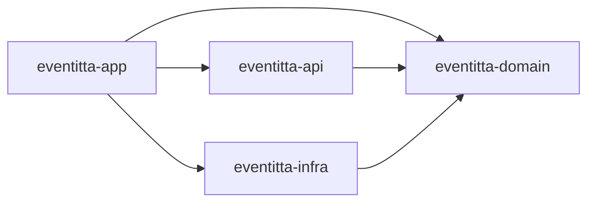
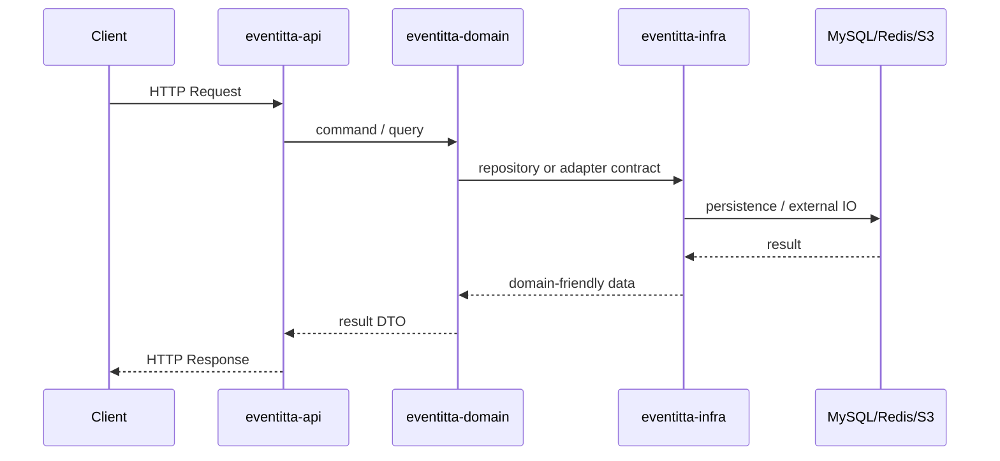

# Architecture

## Goal

이 프로젝트의 핵심 목표는 기능 수를 늘리는 것보다, 단일 백엔드 안에서 변경 영향 범위를 예측 가능한 구조로 관리하는 것이다.  
그래서 Eventitta는 단일 배포 단위를 유지하되 `app / api / domain / infra` 모듈로 경계를 물리적으로 강제하는 modular monolith로 정리했다.

## Module Layout

| 모듈 | 책임 |
| --- | --- |
| `eventitta-app` | 애플리케이션 부트스트랩, 모듈 조립, ArchUnit 규칙 |
| `eventitta-api` | controller, security filter, request/response DTO, web adapter |
| `eventitta-domain` | 도메인 모델, use case service, repository contract, internal facade |
| `eventitta-infra` | JPA/Redis/S3 구현, 외부 API adapter, scheduler |

의존 방향은 아래와 같이 고정한다.


```mermaid
graph LR
  app["eventitta-app"] --> api["eventitta-api"]
  app --> domain["eventitta-domain"]
  app --> infra["eventitta-infra"]
  api --> domain
  infra --> domain
```

- `domain`은 `api`, `infra`, `app`를 참조하지 않는다.
- 도메인 간 상호작용은 repository 직접 참조 대신 internal facade로 제한한다.
- `eventitta-app`에는 새 비즈니스 로직을 두지 않는다.

## Slice Pattern

모든 슬라이스는 아래 서브패키지 규칙을 따른다. 레퍼런스 구현은 `eventitta-domain/src/main/java/com/eventitta/domain/comment` 이다.

### domain 모듈 — `com.eventitta.domain.<slice>`

```text
<slice>/
  domain/                  ← JPA Entity, Value Object, Enum
  repository/              ← Spring Data 인터페이스 + *RepositoryCustom (QueryDSL 커스텀 계약)
  service/                 ← 유스케이스 서비스, 슬라이스 내부 정책, Default*Facade 구현
  api/internal/
    facade/                ← 다른 슬라이스가 사용하는 유일한 진입점 (interface)
    view/                  ← facade 반환 뷰 객체 (선택)
    command/               ← facade 입력 커맨드 (선택)
  dto/
    request/               ← controller → service 입력
    response/              ← service → controller 출력
    projection/            ← QueryDSL / JPA projection (선택)
  exception/               ← <Slice>ErrorCode, <Slice>Exception
  event/                   ← 애플리케이션 이벤트 (선택)
  scheduler/               ← 스케줄 트리거 계약 (선택)
  config/                  ← 슬라이스 전용 @Configuration (선택)
```

### api 모듈 — `com.eventitta.api.<slice>`

```text
<slice>/
  controller/              ← REST 엔드포인트만. 입출력 DTO 는 domain 모듈의 dto 를 재사용
```

슬라이스 전용 web 어댑터 (cookie, oauth 등) 가 필요하면 **용도를 드러내는 이름**으로 서브패키지를 만든다. 모호한 `web/` 은 피한다.

### infra 모듈 — `com.eventitta.infra.<slice>`

```text
<slice>/
  repository/              ← domain 의 Repository 인터페이스 JPA/QueryDSL 구현
  service/                 ← 외부 어댑터 구현 (S3, HTTP client 등)
  config/                  ← 슬라이스 전용 기술 설정 (선택)
  scheduler/               ← Shedlock 기반 스케줄러 구현 (선택)
  event/                   ← 외부 이벤트 어댑터 (선택)
```

### 금지 사항

- domain 슬라이스 안에 `port/dto`, `service/dto`, `dto` 를 혼용하지 않는다. **`dto/` 하나만 사용**한다.
- api 슬라이스 안에 `controller/request`, `controller/response` 를 두지 않는다. domain 의 `dto/request`, `dto/response` 를 그대로 사용한다.
- 모듈 이름과 충돌하는 서브패키지 이름을 만들지 않는다 (예: `api/<slice>/domain/`).
- `<module>/common/` 에는 **최소 2개 이상의 슬라이스가 import 하는 코드만** 승격한다. 한 슬라이스만 쓰는 것은 해당 슬라이스에 둔다.

### 슬라이스 예시

- `auth`: JWT, 쿠키, 세션 관리
- `post`, `comment`: 커뮤니티
- `meeting`: 모임 생성/참가/승인
- `gamification`: 포인트, 활동 집계, 랭킹
- `user`, `region`: 사용자 프로필, 지역 마스터
- `file`: **storage port**. 바이트 저장/조회/검증의 어댑터 경계.
  - 진입점: `FileStorageFacade`, `FileValidationFacade`
  - 구현: `infra/file/service/{LocalFileStorageService, S3FileStorageService}`
  - 원칙: 바이트·경로·검증만 다룬다. 미디어 도메인 규칙은 media 슬라이스에 둔다.
- `media`: **미디어 애셋 도메인**. `MediaAsset` 엔티티, variant/status 상태머신, 업로드·변환·정리 정책, URL 해석.
  - 진입점: `MediaAssetInternalFacade`
  - 의존 방향 (의도): `media → file`. media 가 file 의 storage/validation facade 를 호출한다.
  - 현재 상태: file 쪽 facade 일부가 `MediaCategory`, `MediaStorageProvider`, `MediaPolicyProvider` 를 참조해 **양방향 의존**이 잔존한다. 아래 "known deviations" 참고.

## Internal Facade Rule

다른 도메인의 엔티티나 repository를 직접 보는 대신, 필요한 데이터와 행위를 facade로 노출한다.

예를 들면:

- `UserInternalFacade`: 활성 사용자 검증, 프로필 조회
- `RegionInternalFacade`: 지역 존재 검증
- `PostInternalFacade`: 게시글 존재 검증, 작성자 조회, 미디어 참조 여부 확인
- `GamificationInternalFacade`: 게시글/댓글/모임 활동 적립 및 제거
- `AuthUserLifecycleFacade`: 사용자 비밀번호 변경/탈퇴 시 세션과 identity 정리
- `MeetingUserLifecycleFacade`: 사용자 탈퇴 시 모임 참가 정리

이 패턴 덕분에 `user -> auth`, `user -> meeting`, `media -> post` 같은 직접 의존을 제거할 수 있었다.

## Request Flow


```mermaid
sequenceDiagram
    participant Client
    participant API as eventitta-api
    participant Domain as eventitta-domain
    participant Infra as eventitta-infra
    participant DB as MySQL/Redis/S3

    Client->>API: HTTP Request
    API->>Domain: command / query
    Domain->>Infra: repository or adapter contract
    Infra->>DB: persistence / external IO
    DB-->>Infra: result
    Infra-->>Domain: domain-friendly data
    Domain-->>API: result DTO
    API-->>Client: HTTP Response
```

## Concurrency Strategy

같은 동시성 문제라도 패턴이 다르면 전략을 다르게 적용했다.

- 모임 승인: `SELECT ... FOR UPDATE` 기반 비관적 락
- 포인트/카운터 증감: 원자적 SQL update
- Redis 랭킹: 장애 시 MySQL fallback

이유와 구현 비교는 [TECHNICAL_CHALLENGES.md](./TECHNICAL_CHALLENGES.md)에 정리했다.

## Test Ownership

- `eventitta-app`: ArchUnit과 조립 관점 테스트만 유지
- `eventitta-api`: controller / security / web slice test
- `eventitta-domain`: 도메인 규칙과 서비스 단위 test
- `eventitta-infra`: repository, adapter, scheduler, storage test

현재 기준 검증 커맨드는 아래 두 가지다.

```bash
./gradlew testClasses
./gradlew test
```

## 현재 기준 미준수 (known deviations)

아래 항목은 위 "Slice Pattern" 을 아직 따르지 않는다. 해당 영역을 건드리는 PR 에서 점진적으로 수렴한다 (boy-scout rule). 이 섹션 자체를 목적으로 한 일괄 리팩터는 하지 않는다.

- `domain/auth`: `port/dto/` 와 `service/dto/` 가 공존한다. → `dto/` 로 단일화 필요.
- `domain/auth`: `annotation/` 서브패키지가 슬라이스 루트에 있다. `api/common/security/annotation/` 과 위치 일관성이 없다.
- `domain/user`: 표준에 없는 `persistence/`, `mapper/` 가 있다.
- `domain/file`: `api/internal/view/ValidatedMediaFile` 이 media 개념을 file 슬라이스에 누출한다. 리네이밍 또는 media 로 이동 대상.
- `domain/file` ↔ `domain/media`: 상호 의존. `file/api/internal/facade/FileStorageFacade`, `file/service/FileValidationService` 가 media 타입을 import 한다. 의도된 단방향 (`media → file`) 으로 수렴 필요.
- `api/auth`: `domain/` 서브패키지 (모듈명 충돌, `UserPrincipal` 1개), `jwt/{filter,service,util}` 3-depth, `web/` (Cookie/Kakao/SessionMetadata 혼재), `mapper/`, `properties/`, `constants/`, `config/` 로 표준 대비 과도하게 세분화되어 있다. → 평탄화 및 구체적 이름 부여 대상.
- `api/auth`, `api/user`: `controller/request/`, `controller/response/` 를 자체 보유. → domain 의 `dto/` 재사용으로 이동.
- `api/common/monitoring` 과 `domain/common/monitoring`: 같은 이름의 공통 패키지가 두 모듈에 모두 존재. → 하나로 통합하거나 `api/common/observability` 처럼 명시적으로 rename.
- 슬라이스 커버리지 공백: `festivals` (api·infra 없음), `notification` (api·infra 없음), `media` (api 없음). 엔드포인트가 실제로 생길 때 표준 템플릿에 맞춰 채운다.
