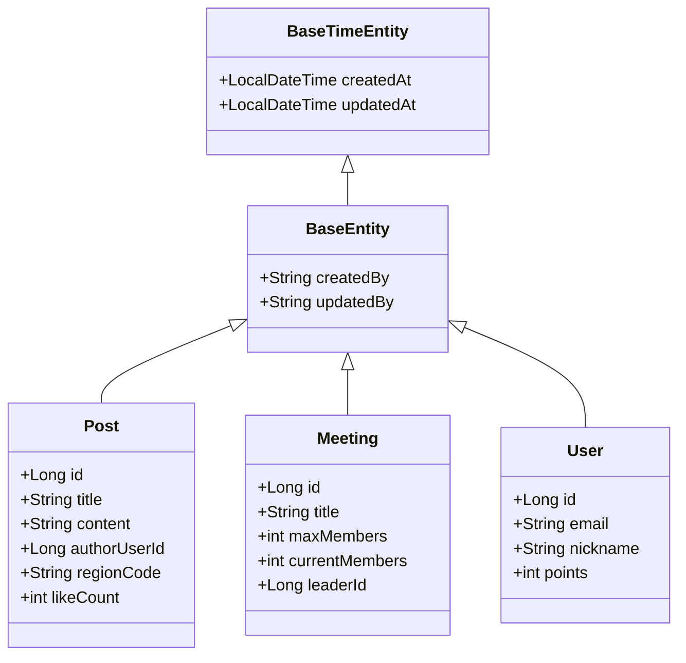
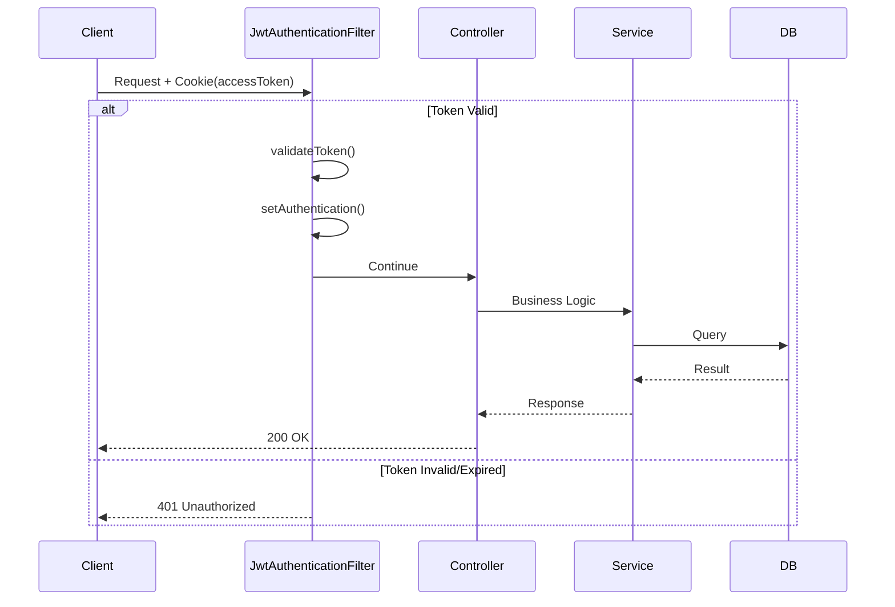
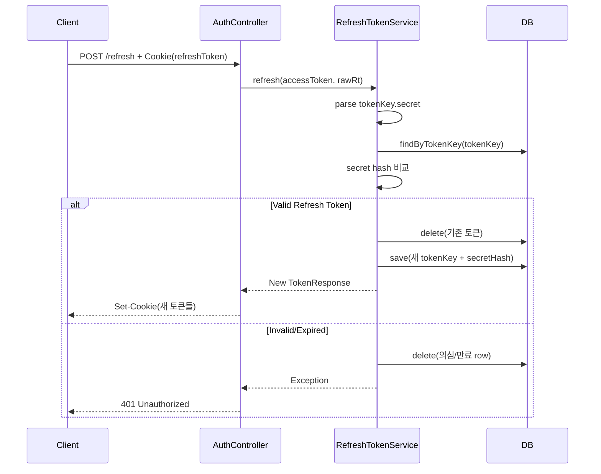
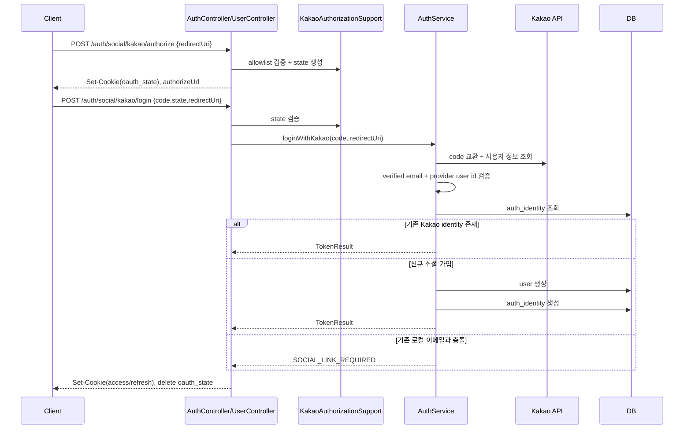
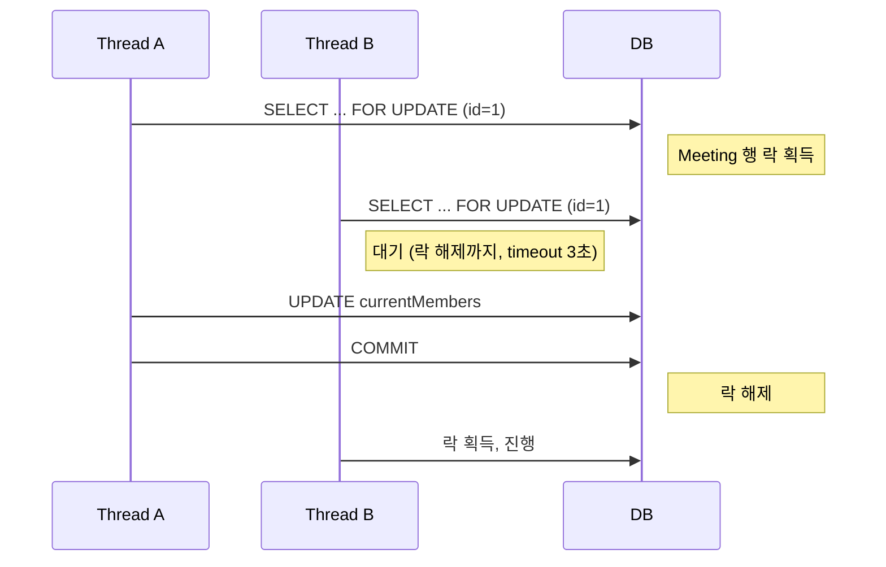
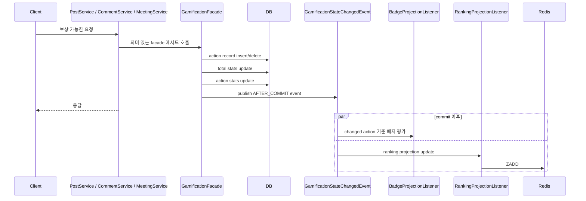
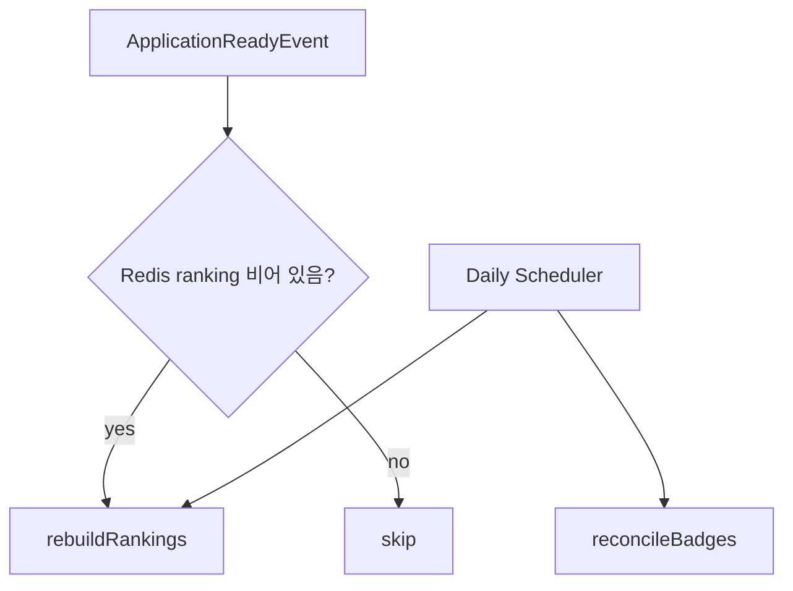
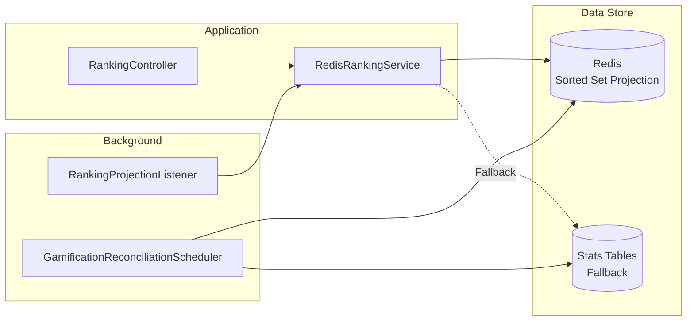
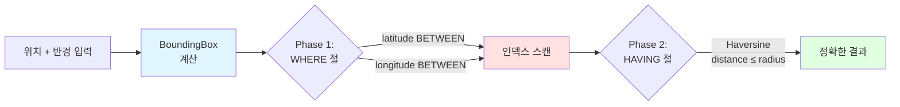

# 아키텍처 설계

## 모듈 구조

현재 백엔드는 4개 Gradle 모듈로 나뉜 modular monolith 구조를 사용합니다.

실행하면서 구조를 따라가고 싶다면 [hands-on/README.md](./hands-on/README.md)의 실습형 가이드를 같이 열어두는 편이 빠릅니다.

```text
eventitta
├── eventitta-app
├── eventitta-api
├── eventitta-domain
└── eventitta-infra
```

### 모듈 책임

- `eventitta-app`
  - Spring Boot 실행 조립
  - ArchUnit
  - 부트/조립 관점 테스트
- `eventitta-api`
  - controller
  - security / auth web adapter
  - cookie writer / state verifier
  - request / response / mapper
- `eventitta-domain`
  - entity
  - use case service
  - repository port
  - `api.internal` contract
  - auth business logic
- `eventitta-infra`
  - JPA / Querydsl 구현
  - Redis / S3 / scheduler / external HTTP client
  - runtime config / properties
  - Kakao REST adapter

### 허용 의존 방향

- `eventitta-app -> eventitta-api, eventitta-domain, eventitta-infra`
- `eventitta-api -> eventitta-domain`
- `eventitta-infra -> eventitta-domain`
- `eventitta-domain ->` no dependency on `api/infra/app`

### 도메인 경계 규칙

- foreign domain 쓰기 경로는 `api.internal..` contract 를 통해서만 접근한다.
- foreign entity / repository / service 직접 참조는 금지한다.
- domain 안에서는 `MultipartFile`, `Resource`, `MediaType`, `@ConfigurationProperties`, `@GetExchange` 를 사용하지 않는다.
- read-side 는 응답 호환성을 위해 당분간 infra query projection join 을 허용한다.

### DTO 및 Mapper 원칙

- DTO는 소유 계층 기준으로 배치한다.
- 계층 간 변환은 기본적으로 각 도메인 패키지의 `mapper`에서 `MapStruct`로 처리한다.
- Controller는 Request/Response를 직접 조립하지 않고 mapper를 통해 Service DTO와 연결한다.
- Service도 단순 DTO 조립보다는 mapper를 사용하고, 도메인 규칙이나 계산 로직만 직접 가진다.
- 자세한 규칙은 [DTO_GUIDELINES.md](./DTO_GUIDELINES.md)를 따른다.

## 엔티티 상속 구조


```mermaid
classDiagram
    class BaseTimeEntity {
        +LocalDateTime createdAt
        +LocalDateTime updatedAt
    }

    class BaseEntity {
        +String createdBy
        +String updatedBy
    }

    class Post {
        +Long id
        +String title
        +String content
        +Long authorUserId
        +String regionCode
        +int likeCount
    }

    class User {
        +Long id
        +String email
        +String nickname
        +int points
    }

    class Meeting {
        +Long id
        +String title
        +int maxMembers
        +int currentMembers
        +Long leaderId
    }

    BaseTimeEntity <|-- BaseEntity
    BaseEntity <|-- Post
    BaseEntity <|-- Meeting
    BaseEntity <|-- User
```

### Base 엔티티 계층

- **BaseTimeEntity**: `createdAt`, `updatedAt` (JPA Auditing)
- **BaseEntity**: `BaseTimeEntity` 상속 + `createdBy`(String), `updatedBy`(String) 추가
- 각 엔티티는 `@Id` 필드를 직접 선언

## 게시글 좋아요/조회 계약

- 게시글 목록/상세 조회는 공개 API를 유지하고, 인증 사용자가 호출하면 `likedByMe`를 함께 계산한다.
- 좋아요 변경은 토글 API 대신 상태 명시형 API를 사용한다.
  - `PUT /api/v1/posts/{postId}/like`
  - `DELETE /api/v1/posts/{postId}/like`
- 두 API는 모두 `PostLikeStateResponse`를 반환하며, 응답에는 `postId`, `likedByMe`, `likeCount`가 포함된다.
- `PostSummaryResponse`, `PostDetailResponse`에는 `likedByMe`가 포함된다.
- `Post.likeCount` 필드는 스키마 호환을 위해 남아 있지만, API 응답용 `likeCount`는 `post_likes`를 source of truth로 계산한다.

## 테스트 소유권

- `eventitta-api`
  - controller / request validation / web adapter 테스트
- `eventitta-domain`
  - entity / use case / domain service 테스트
- `eventitta-infra`
  - repository / query / Redis / S3 / external adapter 테스트
- `eventitta-app`
  - boot smoke / ArchUnit / 조립 관점 테스트

## 인증/인가 아키텍처

### JWT 기반 인증 플로우


```mermaid
sequenceDiagram
    participant Client
    participant Filter as JwtAuthenticationFilter
    participant Controller
    participant Service
    participant DB

    Client->>Filter: Request + Cookie(accessToken)
    alt Token Valid
        Filter->>Filter: validateToken()
        Filter->>Filter: setAuthentication()
        Filter->>Controller: Continue
        Controller->>Service: Business Logic
        Service->>DB: Query
        DB-->>Service: Result
        Service-->>Controller: Response
        Controller-->>Client: 200 OK
    else Token Invalid/Expired
        Filter-->>Client: 401 Unauthorized
    end
```

### Auth ownership

- `eventitta-domain.auth..`
  - signup/login/refresh/logout
  - refresh token rotation / reuse detection
  - Kakao login / link use case
- `eventitta-api.auth..`
  - controller, JWT filter, cookie 입출력, state cookie 검증, request/response mapping
- `eventitta-infra.auth..`
  - JPA 저장소 adapter
  - Kakao token/user API adapter

### 토큰 재발급 플로우


```mermaid
sequenceDiagram
    participant Client
    participant Controller as AuthController
    participant Service as RefreshTokenService
    participant DB

    Client->>Controller: POST /refresh + Cookie(refreshToken)
    Controller->>Service: refresh(accessToken, rawRt)
    Service->>Service: parse tokenKey.secret
    Service->>DB: findByTokenKey(tokenKey)
    Service->>Service: secret hash 비교
    alt Valid Refresh Token
        Service->>DB: delete(기존 토큰)
        Service->>DB: save(새 tokenKey + secretHash)
        Service-->>Controller: New TokenResponse
        Controller-->>Client: Set-Cookie(새 토큰들)
    else Invalid/Expired
        Service->>DB: delete(의심/만료 row)
        Service-->>Controller: Exception
        Controller-->>Client: 401 Unauthorized
    end
```

### Kakao social login 플로우


```mermaid
sequenceDiagram
    participant Client
    participant Api as AuthController/UserController
    participant Support as KakaoAuthorizationSupport
    participant Domain as AuthService
    participant Kakao as Kakao API
    participant DB

    Client->>Api: POST /auth/social/kakao/authorize {redirectUri}
    Api->>Support: allowlist 검증 + state 생성
    Api-->>Client: Set-Cookie(oauth_state), authorizeUrl

    Client->>Api: POST /auth/social/kakao/login {code,state,redirectUri}
    Api->>Support: state 검증
    Api->>Domain: loginWithKakao(code, redirectUri)
    Domain->>Kakao: code 교환 + 사용자 정보 조회
    Domain->>Domain: verified email + provider user id 검증
    Domain->>DB: auth_identity 조회
    alt 기존 Kakao identity 존재
        Domain-->>Api: TokenResult
    else 신규 소셜 가입
        Domain->>DB: user 생성
        Domain->>DB: auth_identity 생성
        Domain-->>Api: TokenResult
    else 기존 로컬 이메일과 충돌
        Domain-->>Api: SOCIAL_LINK_REQUIRED
    end
    Api-->>Client: Set-Cookie(access/refresh), delete oauth_state
```

### 토큰 관리 전략

| 항목 | Access Token | Refresh Token |
|------|-------------|---------------|
| **유효기간** | 1시간 | 24시간 |
| **저장 위치** | HttpOnly Cookie | HttpOnly Cookie |
| **서버 저장** | 없음 (Stateless) | `token_key + PBKDF2(secret)` DB 저장 |
| **조회 방식** | JWT 자체 검증 | `findByTokenKey` 후 secret hash 검증 |
| **보안** | XSS 방어 (HttpOnly) | 탈취 대응 (해시 저장), reuse 의심 row 제거 |

### 소셜 계정 관리 전략

- 소셜 로그인 식별자는 `users.provider/provider_id` 단일 필드가 아니라 `auth_identity(provider, provider_user_id)` 를 사용한다.
- 신규 provider 추가를 위해 `auth_identity` 는 user 기준 1:N 구조를 가진다.
- Kakao 로그인은 verified email 을 요구하지만, 이메일은 자동 링크 기준으로 사용하지 않는다.
- 기존 로컬 계정과 이메일이 충돌하면 자동 병합하지 않고 `SOCIAL_LINK_REQUIRED` 를 반환한다.
- 명시적 링크는 로그인된 로컬 세션에서만 허용하며, 현재 사용자 이메일과 Kakao verified email 이 같을 때만 수행한다.

### 보안 기능

1. **JWT + HttpOnly Cookie + SameSite=Strict**: XSS + CSRF 방어
2. **Refresh token selector 모델**: `token_key` 인덱스 조회 후 secret 해시 검증으로 scan 제거
3. **OAuth state cookie + redirect URI allowlist**: Kakao code interception / open redirect 완화
4. **verified email + explicit link only**: 실수 병합 방지
5. **비밀번호 BCrypt 해싱**: 사용자 비밀번호 보호
6. **QueryDSL + PreparedStatement**: SQL Injection 방지

## 동시성 제어 전략

### 비관적 락 (모임 참가 승인)


```mermaid
sequenceDiagram
    participant Thread A
    participant Thread B
    participant DB

    Thread A->>DB: SELECT ... FOR UPDATE (id=1)
    Note right of DB: Meeting 행 락 획득
    Thread B->>DB: SELECT ... FOR UPDATE (id=1)
    Note right of Thread B: 대기 (락 해제까지, timeout 3초)
    Thread A->>DB: UPDATE currentMembers
    Thread A->>DB: COMMIT
    Note right of DB: 락 해제
    Thread B->>DB: 락 획득, 진행
```

### 락 구현

```java
// MeetingRepository.java
@Lock(LockModeType.PESSIMISTIC_WRITE)
@QueryHints({
    @QueryHint(name = "jakarta.persistence.lock.timeout", value = "3000")
})
@Query("SELECT m FROM Meeting m WHERE m.id = :id")
Optional<Meeting> findByIdForUpdate(@Param("id") Long id);
```

### Atomic Update (포인트 증감)

```java
// UserRepository.java
@Modifying(clearAutomatically = true, flushAutomatically = true)
@Query("UPDATE User u SET u.points = u.points + :amount WHERE u.id = :userId")
int incrementPoints(@Param("userId") Long userId, @Param("amount") int amount);
```

## 게임화 처리 아키텍처

현재 게임화는 `동기 코어 + AFTER_COMMIT projection` 모델을 사용합니다.

- 코어 적립/회수는 요청 트랜잭션 안에서 완료됩니다.
- Redis 랭킹과 뱃지는 commit 이후 projection으로 반영됩니다.
- 복구 스케줄러는 self-healing 용도로만 남아 있습니다.

상세 문서:

- [GAMIFICATION_USER_STRUCTURE.md](./GAMIFICATION_USER_STRUCTURE.md)
- [docs/gamification/OVERVIEW.md](./gamification/OVERVIEW.md)
- [docs/gamification/RUNTIME_FLOW.md](./gamification/RUNTIME_FLOW.md)
- [docs/gamification/MIGRATION_AND_OPERATIONS.md](./gamification/MIGRATION_AND_OPERATIONS.md)

### 현재 이벤트 플로우


```mermaid
sequenceDiagram
    participant Client
    participant Domain as PostService / CommentService / MeetingService
    participant Facade as GamificationFacade
    participant DB
    participant Event as GamificationStateChangedEvent
    participant Badge as BadgeProjectionListener
    participant Ranking as RankingProjectionListener
    participant Redis

    Client->>Domain: 보상 가능한 요청
    Domain->>Facade: 의미 있는 facade 메서드 호출
    Facade->>DB: action record insert/delete
    Facade->>DB: total stats update
    Facade->>DB: action stats update
    Facade->>Event: publish AFTER_COMMIT event
    Domain-->>Client: 응답

    par commit 이후
        Event->>Badge: changed action 기준 배지 평가
    and
        Event->>Ranking: ranking projection update
        Ranking->>Redis: ZADD
    end
```

### projection 복구 플로우


```mermaid
flowchart TD
    A[ApplicationReadyEvent] --> B{Redis ranking 비어 있음?}
    B -->|yes| C[rebuildRankings]
    B -->|no| D[skip]
    E[Daily Scheduler] --> C
    E --> F[reconcileBadges]
```

## 스케줄러 설계

### ShedLock으로 분산 락 보장

모든 스케줄러에 ShedLock을 적용하여 다중 인스턴스 환경에서 단일 실행을 보장합니다.

### 스케줄러 목록

| 스케줄러 | 실행 주기 | 목적 |
|----------|-----------|------|
| FestivalScheduler (National) | 분기별 (1/4/7/10월 1일 02:00) | 전국 축제 데이터 동기화 |
| FestivalScheduler (Seoul) | 매일 11:00 | 서울시 축제 데이터 동기화 |
| MeetingStatusScheduler | 매 1분 | 종료된 모임 상태 자동 업데이트 |
| RefreshTokenCleanupScheduler | 매 1시간 | 만료된 Refresh Token 정리 |
| MediaAssetCleanupScheduler | 매주 일요일 04:00 | 미사용 이미지 파일 정리 |
| GamificationReconciliationScheduler | 매일 04:00 | Redis 랭킹 rebuild + 배지 복구 |

## 모니터링 & 로깅

### Discord 알림

- 에러 발생 시 자동 알림 (Discord Webhook)
- Alert Level 기반 차등 제한 (CRITICAL/HIGH/MEDIUM/INFO)
- Rate Limiting으로 알림 스팸 방지

### P6Spy SQL 모니터링

- 모든 SQL 쿼리 로깅
- 실행 시간 측정
- 파라미터 바인딩 값 표시

## Redis 기반 실시간 랭킹 시스템

### 아키텍처


```mermaid
graph LR
    subgraph "Application"
        A[RankingController]
        B[RedisRankingService]
    end

    subgraph "Data Store"
        C[(Redis<br>Sorted Set Projection)]
        D[(Stats Tables<br>Fallback)]
    end

    subgraph "Background"
        E[RankingProjectionListener]
        F[GamificationReconciliationScheduler]
    end

    A --> B
    B --> C
    B -.Fallback.-> D
    E --> B
    F --> C
    F --> D
```

### 랭킹 시스템 설계

- **Redis Sorted Set**: 포인트/활동량 projection
- **Stats Fallback**: Redis 비어 있음 또는 장애 시 `user_gamification_stats` 기준 조회
- **Projection Update**: `RankingProjectionListener`가 commit 이후 delta 반영
- **Self-healing**: `GamificationReconciliationScheduler`가 full rebuild 수행

## Festival 거리 검색 최적화

### Two-Phase Filtering 전략


```mermaid
graph LR
    A[위치 + 반경 입력] --> B[BoundingBox<br>계산]
    B --> C{Phase 1:<br>WHERE 절}
    C -->|latitude BETWEEN| D[인덱스 스캔]
    C -->|longitude BETWEEN| D
    D --> E{Phase 2:<br>HAVING 절}
    E -->|Haversine<br>distance ≤ radius| F[정확한 결과]

    style B fill:#e1f5ff
    style D fill:#ffe1e1
    style F fill:#e1ffe1
```

### 구현

```java
// BoundingBoxCalculator.java
public BoundingBox calculate(double latitude, double longitude, double distanceKm) {
    double latDelta = distanceKm / KM_PER_DEGREE_LAT;        // 위도 1도 ≈ 111km
    double lonDelta = distanceKm / (KM_PER_DEGREE_LAT
        * Math.cos(Math.toRadians(latitude)));                // 경도 보정

    return new BoundingBox(
        latitude - latDelta, latitude + latDelta,
        longitude - lonDelta, longitude + lonDelta
    );
}
```

```sql
-- 2단계 쿼리 필터링
SELECT f.*, (6371 * acos(...)) AS distance
FROM festivals f
WHERE
  f.latitude BETWEEN :minLat AND :maxLat      -- Phase 1: 인덱스 스캔
  AND f.longitude BETWEEN :minLon AND :maxLon
  AND f.start_date >= DATE(:startDateTime)
HAVING distance <= :distanceKm                -- Phase 2: 정확한 거리 계산
ORDER BY distance ASC
```

---

**Last Updated**: 2026-02-15
