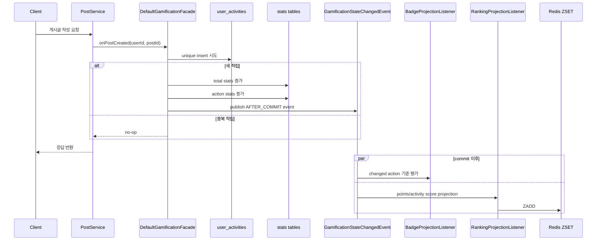
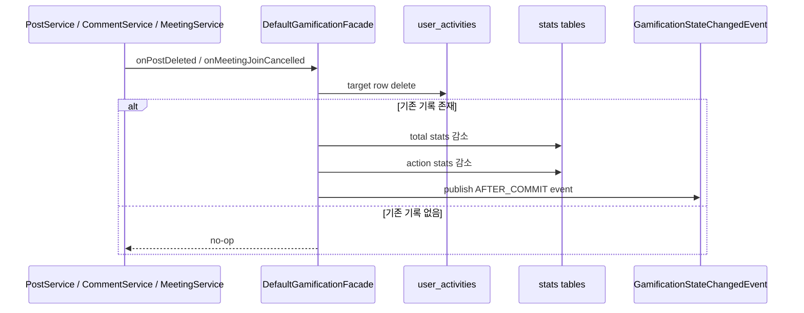
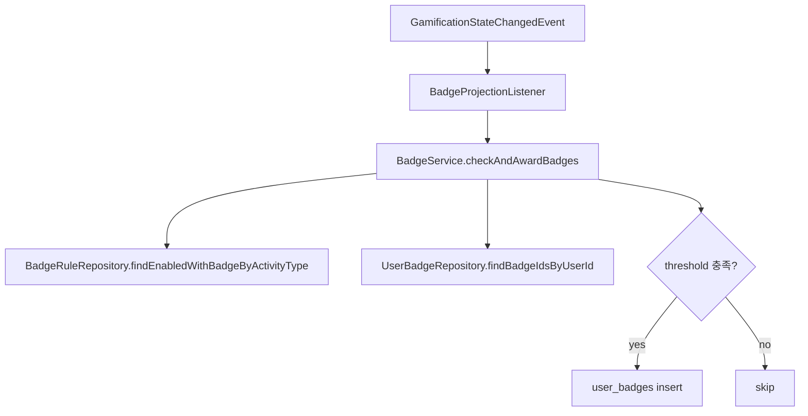
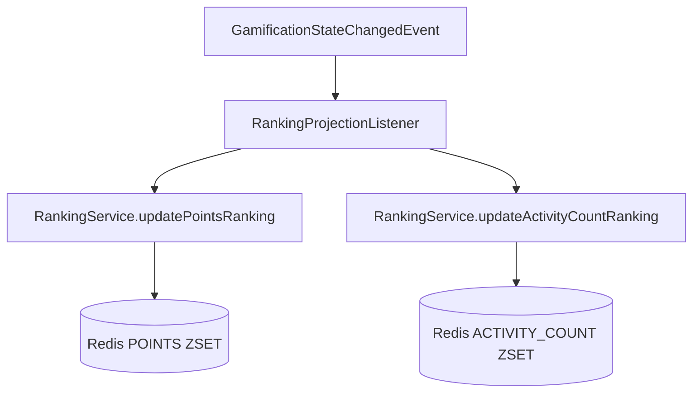
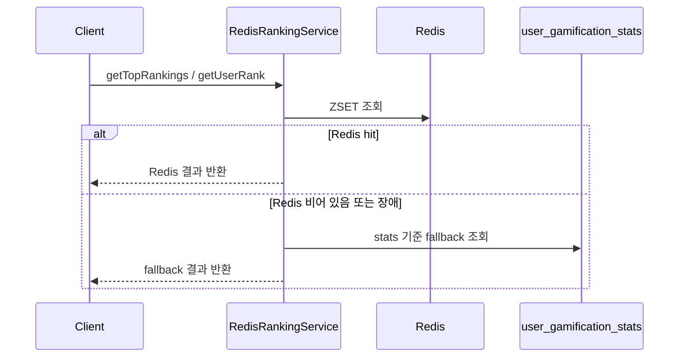
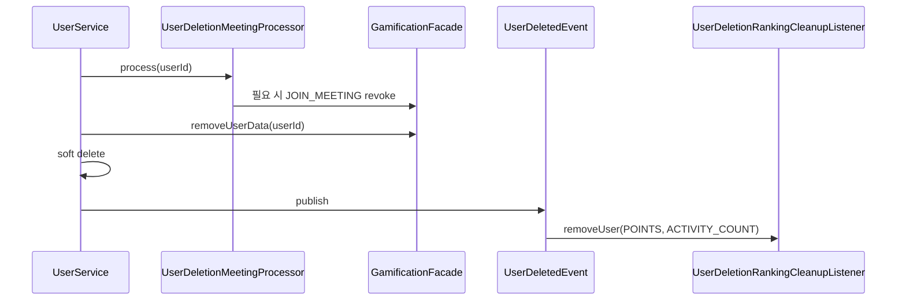
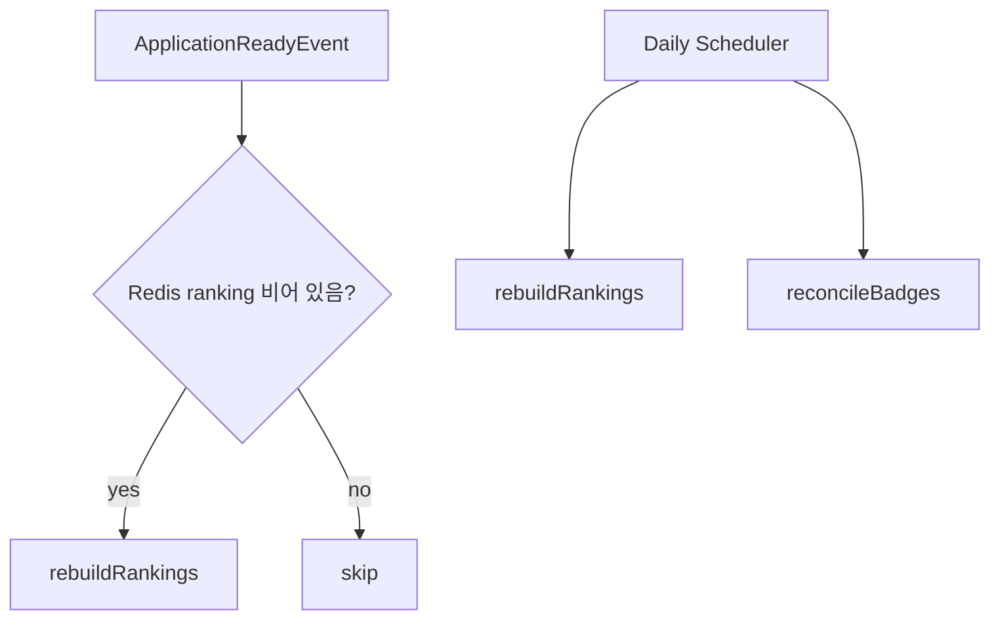

# Gamification 런타임 흐름

## 목적

이 문서는 현재 코드에서 gamification이 실제로 어떻게 동작하는지 요청 흐름 기준으로 설명합니다.

핵심은 아래 두 가지입니다.

- 코어 상태는 동기 트랜잭션에서 끝난다.
- 배지와 랭킹은 `AFTER_COMMIT` projection으로 따라온다.

## 1. 적립 흐름

예시는 게시글 작성이지만, 댓글 작성 / 좋아요 / 모임 승인도 같은 패턴입니다.

## 적립 시 실제 순서

1. 도메인 서비스가 `GamificationFacade`를 호출합니다.
2. facade는 `user_activities`에 unique row insert를 시도합니다.
3. insert 성공 시에만 `user_gamification_stats`, `user_activity_stats`를 증가시킵니다.
4. 현재 stats 값을 포함한 `GamificationStateChangedEvent`를 발행합니다.
5. 트랜잭션 commit 후 배지와 랭킹 projection이 비동기로 처리됩니다.

관련 코드:

- [`DefaultGamificationFacade`](../../src/main/java/com/eventitta/gamification/service/DefaultGamificationFacade.java)
- [`GamificationStateChangedEvent`](../../src/main/java/com/eventitta/gamification/event/GamificationStateChangedEvent.java)
- [`BadgeProjectionListener`](../../src/main/java/com/eventitta/gamification/event/BadgeProjectionListener.java)
- [`RankingProjectionListener`](../../src/main/java/com/eventitta/gamification/event/RankingProjectionListener.java)

## 2. 회수 흐름

삭제/취소는 별도 reward type을 쓰지 않고 positive action을 revoke합니다.

좋아요는 현재 gamification reward 대상이 아니므로 이 회수 흐름에 포함되지 않습니다.

## 회수 시 중요한 규칙

- delete 성공한 경우에만 stats가 감소합니다.
- 음수 row를 남기지 않습니다.
- action stats가 `0 / 0`이 되면 row를 정리합니다.

## 3. 배지 지급 흐름

배지는 commit 이후 후처리입니다.

## 배지 평가 기준

- changed action type에 해당하는 규칙만 읽습니다.
- `user_activity_stats.action_count`
- `user_activity_stats.points_total`

즉, 더 이상 raw `user_activities` 전체 집계를 매번 수행하지 않습니다.

## 4. 랭킹 projection 흐름

## 랭킹 조회 흐름

## 랭킹 fallback 기준

- 포인트 랭킹: `user_gamification_stats.total_points`
- 활동 랭킹: `user_gamification_stats.total_activity_count`
- tie-break: `userId ASC`

즉, Redis projection이 비어 있어도 기준값은 stats에서 복구 가능합니다.

## 5. 회원 탈퇴 흐름

## 탈퇴 시 정리 범위

- `user_activities`
- `user_activity_stats`
- `user_gamification_stats`
- `user_badges`
- Redis 랭킹 멤버

## 6. 복구 흐름

projection은 정확성의 핵심 경로가 아니라 self-healing 계층입니다.

관련 코드:

- [`GamificationReconciliationService`](../../src/main/java/com/eventitta/gamification/service/GamificationReconciliationService.java)
- [`GamificationReconciliationScheduler`](../../src/main/java/com/eventitta/gamification/scheduler/GamificationReconciliationScheduler.java)

## 7. 요청 경로의 쿼리 특성

현재 설계 의도는 요청 경로에서 O(1) 쓰기 수를 유지하는 것입니다.

### 적립 요청

- `user_activities` insert 1회
- `user_gamification_stats` update/upsert 1회
- `user_activity_stats` update/upsert 1회

### 회수 요청

- `user_activities` delete 1회
- `user_gamification_stats` update 1회
- `user_activity_stats` update + 필요 시 delete 1회

### 요청 경로에서 피한 것

- raw activity group by
- `users.points` read-modify-write
- polling backlog 의존
- multi-step retry pipeline

## 같이 보면 좋은 코드

- [`PostService`](../../src/main/java/com/eventitta/post/service/PostService.java)
- [`CommentService`](../../src/main/java/com/eventitta/comment/service/CommentService.java)
- [`MeetingService`](../../src/main/java/com/eventitta/meeting/service/MeetingService.java)
- [`UserService`](../../src/main/java/com/eventitta/user/service/UserService.java)
